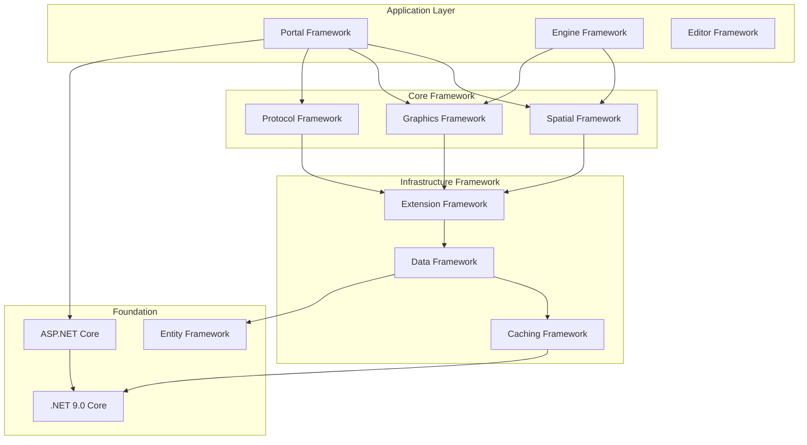

# Framework Architecture
## Wangkanai Planet - Framework Design & Implementation

> **Version:** 1.0  
> **Date:** January 2025  
> **Last Updated:** January 2025

---

## 📋 Table of Contents

- [🎯 Framework Overview](#-framework-overview)
- [🏗️ Architectural Patterns](#️-architectural-patterns)
- [📦 Component Framework](#-component-framework)
- [🔧 Extension Framework](#-extension-framework)
- [🌐 Web Framework](#-web-framework)
- [📊 Data Framework](#-data-framework)
- [🎨 Graphics Framework](#-graphics-framework)
- [🗺️ Spatial Framework](#-spatial-framework)
- [🔌 Protocol Framework](#-protocol-framework)
- [⚡ Performance Framework](#-performance-framework)

---

## 🎯 Framework Overview

The Wangkanai Planet framework is designed as a modular, extensible platform for geospatial data processing and tile serving. It follows modern architectural principles and provides a solid foundation for building scalable mapping applications.

### Design Principles

#### Core Principles
- **Modularity** - Loosely coupled, highly cohesive components
- **Extensibility** - Plugin-based architecture for customization
- **Performance** - Optimized for high-throughput geospatial processing
- **Standards Compliance** - Adherence to OGC and industry standards
- **Cross-Platform** - Windows, Linux, macOS compatibility

#### Framework Goals
- **Developer Experience** - Intuitive APIs and comprehensive tooling
- **Operational Excellence** - Built-in monitoring, logging, and diagnostics
- **Scalability** - Horizontal scaling with container orchestration
- **Maintainability** - Clean code architecture and automated testing

### Framework Stack



---

## 🏗️ Architectural Patterns

### Clean Architecture Implementation

#### Layer Dependencies
```csharp
// Domain Layer (Core)
namespace Wangkanai.Planet.Domain
{
    public class Tile
    {
        public int X { get; set; }
        public int Y { get; set; }
        public int Z { get; set; }
        public byte[] Data { get; set; }
        public TileFormat Format { get; set; }
    }
    
    public interface ITileRepository
    {
        Task<Tile> GetTileAsync(int x, int y, int z);
        Task SaveTileAsync(Tile tile);
    }
}

// Application Layer (Use Cases)
namespace Wangkanai.Planet.Application
{
    public class GenerateTileUseCase
    {
        private readonly ITileRepository _tileRepository;
        private readonly ITileGenerator _tileGenerator;
        
        public GenerateTileUseCase(
            ITileRepository tileRepository,
            ITileGenerator tileGenerator)
        {
            _tileRepository = tileRepository;
            _tileGenerator = tileGenerator;
        }
        
        public async Task<TileResult> ExecuteAsync(TileRequest request)
        {
            // Use case implementation
        }
    }
}

// Infrastructure Layer (Implementation)
namespace Wangkanai.Planet.Infrastructure
{
    public class SqliteTileRepository : ITileRepository
    {
        private readonly DbContext _context;
        
        public async Task<Tile> GetTileAsync(int x, int y, int z)
        {
            // Database implementation
        }
    }
}

// Presentation Layer (Controllers)
namespace Wangkanai.Planet.Portal.Controllers
{
    [ApiController]
    [Route("api/tiles")]
    public class TilesController : ControllerBase
    {
        private readonly GenerateTileUseCase _generateTileUseCase;
        
        [HttpGet("{z}/{x}/{y}.{format}")]
        public async Task<IActionResult> GetTile(int x, int y, int z, string format)
        {
            // Controller implementation
        }
    }
}
```

### CQRS Pattern Implementation

#### Command Pattern
```csharp
// Command Definition
public class ProcessDatasetCommand : ICommand<ProcessDatasetResult>
{
    public string DatasetId { get; set; }
    public ProcessingOptions Options { get; set; }
}

// Command Handler
public class ProcessDatasetCommandHandler : ICommandHandler<ProcessDatasetCommand, ProcessDatasetResult>
{
    private readonly IDatasetRepository _datasetRepository;
    private readonly IProcessingEngine _processingEngine;
    
    public async Task<ProcessDatasetResult> HandleAsync(
        ProcessDatasetCommand command,
        CancellationToken cancellationToken)
    {
        var dataset = await _datasetRepository.GetByIdAsync(command.DatasetId);
        
        var result = await _processingEngine.ProcessAsync(dataset, command.Options);
        
        return new ProcessDatasetResult
        {
            JobId = result.JobId,
            Status = result.Status
        };
    }
}
```

#### Query Pattern
```csharp
// Query Definition
public class GetLayerQuery : IQuery<LayerDto>
{
    public string LayerId { get; set; }
}

// Query Handler
public class GetLayerQueryHandler : IQueryHandler<GetLayerQuery, LayerDto>
{
    private readonly ILayerRepository _layerRepository;
    
    public async Task<LayerDto> HandleAsync(
        GetLayerQuery query,
        CancellationToken cancellationToken)
    {
        var layer = await _layerRepository.GetByIdAsync(query.LayerId);
        
        return new LayerDto
        {
            Id = layer.Id,
            Name = layer.Name,
            Description = layer.Description
        };
    }
}
```

### Mediator Pattern

#### MediatR Integration
```csharp
// Mediator Setup
services.AddMediatR(cfg => cfg.RegisterServicesFromAssembly(typeof(Program).Assembly));

// Controller Usage
[ApiController]
public class LayersController : ControllerBase
{
    private readonly IMediator _mediator;
    
    public LayersController(IMediator mediator)
    {
        _mediator = mediator;
    }
    
    [HttpGet("{id}")]
    public async Task<IActionResult> GetLayer(string id)
    {
        var query = new GetLayerQuery { LayerId = id };
        var result = await _mediator.Send(query);
        return Ok(result);
    }
    
    [HttpPost("process")]
    public async Task<IActionResult> ProcessDataset(ProcessDatasetCommand command)
    {
        var result = await _mediator.Send(command);
        return Ok(result);
    }
}
```

---

## 📦 Component Framework

### Base Component Architecture

#### Component Lifecycle
```csharp
public abstract class PlanetComponent : IDisposable
{
    protected ILogger Logger { get; }
    protected IConfiguration Configuration { get; }
    
    protected PlanetComponent(ILogger logger, IConfiguration configuration)
    {
        Logger = logger ?? throw new ArgumentNullException(nameof(logger));
        Configuration = configuration ?? throw new ArgumentNullException(nameof(configuration));
    }
    
    public virtual async Task InitializeAsync()
    {
        Logger.LogInformation("Initializing component {ComponentType}", GetType().Name);
        await OnInitializeAsync();
    }
    
    protected abstract Task OnInitializeAsync();
    
    public virtual async Task StartAsync(CancellationToken cancellationToken)
    {
        Logger.LogInformation("Starting component {ComponentType}", GetType().Name);
        await OnStartAsync(cancellationToken);
    }
    
    protected abstract Task OnStartAsync(CancellationToken cancellationToken);
    
    public virtual async Task StopAsync(CancellationToken cancellationToken)
    {
        Logger.LogInformation("Stopping component {ComponentType}", GetType().Name);
        await OnStopAsync(cancellationToken);
    }
    
    protected abstract Task OnStopAsync(CancellationToken cancellationToken);
    
    protected virtual void Dispose(bool disposing)
    {
        if (disposing)
        {
            Logger.LogInformation("Disposing component {ComponentType}", GetType().Name);
        }
    }
    
    public void Dispose()
    {
        Dispose(true);
        GC.SuppressFinalize(this);
    }
}
```

#### Component Registration
```csharp
public static class ServiceCollectionExtensions
{
    public static IServiceCollection AddPlanetComponents(
        this IServiceCollection services,
        IConfiguration configuration)
    {
        // Core components
        services.AddScoped<ITileGenerator, TileGenerator>();
        services.AddScoped<ILayerManager, LayerManager>();
        services.AddScoped<IDatasetProcessor, DatasetProcessor>();
        
        // Register component configurations
        services.Configure<TileGeneratorOptions>(
            configuration.GetSection("TileGenerator"));
        services.Configure<LayerManagerOptions>(
            configuration.GetSection("LayerManager"));
        
        return services;
    }
}
```

### Configuration Framework

#### Options Pattern
```csharp
public class TileGeneratorOptions
{
    public const string SectionName = "TileGenerator";
    
    public int MaxConcurrentJobs { get; set; } = 5;
    public int TileSize { get; set; } = 256;
    public int MaxZoomLevel { get; set; } = 18;
    public string DefaultFormat { get; set; } = "png";
    public CompressionOptions Compression { get; set; } = new();
    
    public class CompressionOptions
    {
        public int Quality { get; set; } = 85;
        public bool EnableGzip { get; set; } = true;
    }
}

// Usage in component
public class TileGenerator
{
    private readonly TileGeneratorOptions _options;
    
    public TileGenerator(IOptions<TileGeneratorOptions> options)
    {
        _options = options.Value;
    }
}
```

#### Configuration Validation
```csharp
public class TileGeneratorOptionsValidator : IValidateOptions<TileGeneratorOptions>
{
    public ValidateOptionsResult Validate(string name, TileGeneratorOptions options)
    {
        var failures = new List<string>();
        
        if (options.MaxConcurrentJobs <= 0)
        {
            failures.Add("MaxConcurrentJobs must be greater than 0");
        }
        
        if (options.TileSize <= 0 || options.TileSize > 1024)
        {
            failures.Add("TileSize must be between 1 and 1024");
        }
        
        if (failures.Any())
        {
            return ValidateOptionsResult.Fail(failures);
        }
        
        return ValidateOptionsResult.Success;
    }
}

// Registration
services.AddSingleton<IValidateOptions<TileGeneratorOptions>, TileGeneratorOptionsValidator>();
```

---

## 🔧 Extension Framework

### Plugin Architecture

#### Plugin Interface
```csharp
public interface IPlanetPlugin
{
    string Name { get; }
    string Version { get; }
    string Description { get; }
    
    Task InitializeAsync(IServiceProvider serviceProvider);
    Task ConfigureServicesAsync(IServiceCollection services, IConfiguration configuration);
}

public abstract class PlanetPluginBase : IPlanetPlugin
{
    public abstract string Name { get; }
    public abstract string Version { get; }
    public abstract string Description { get; }
    
    public virtual Task InitializeAsync(IServiceProvider serviceProvider)
    {
        return Task.CompletedTask;
    }
    
    public virtual Task ConfigureServicesAsync(IServiceCollection services, IConfiguration configuration)
    {
        return Task.CompletedTask;
    }
}
```

#### Plugin Discovery
```csharp
public class PluginManager
{
    private readonly List<IPlanetPlugin> _plugins = new();
    private readonly ILogger<PluginManager> _logger;
    
    public PluginManager(ILogger<PluginManager> logger)
    {
        _logger = logger;
    }
    
    public async Task DiscoverPluginsAsync(string pluginDirectory)
    {
        _logger.LogInformation("Discovering plugins in {Directory}", pluginDirectory);
        
        if (!Directory.Exists(pluginDirectory))
        {
            _logger.LogWarning("Plugin directory not found: {Directory}", pluginDirectory);
            return;
        }
        
        var assemblyFiles = Directory.GetFiles(pluginDirectory, "*.dll");
        
        foreach (var assemblyFile in assemblyFiles)
        {
            try
            {
                var assembly = Assembly.LoadFrom(assemblyFile);
                var pluginTypes = assembly.GetTypes()
                    .Where(t => typeof(IPlanetPlugin).IsAssignableFrom(t) && !t.IsInterface && !t.IsAbstract);
                
                foreach (var pluginType in pluginTypes)
                {
                    var plugin = (IPlanetPlugin)Activator.CreateInstance(pluginType);
                    _plugins.Add(plugin);
                    
                    _logger.LogInformation("Discovered plugin: {Name} v{Version}", 
                        plugin.Name, plugin.Version);
                }
            }
            catch (Exception ex)
            {
                _logger.LogWarning(ex, "Failed to load plugin assembly: {Assembly}", assemblyFile);
            }
        }
    }
    
    public async Task InitializePluginsAsync(IServiceProvider serviceProvider)
    {
        foreach (var plugin in _plugins)
        {
            try
            {
                await plugin.InitializeAsync(serviceProvider);
                _logger.LogInformation("Initialized plugin: {Name}", plugin.Name);
            }
            catch (Exception ex)
            {
                _logger.LogError(ex, "Failed to initialize plugin: {Name}", plugin.Name);
            }
        }
    }
}
```

#### Example Plugin Implementation
```csharp
public class GoogleMapsPlugin : PlanetPluginBase
{
    public override string Name => "Google Maps Provider";
    public override string Version => "1.0.0";
    public override string Description => "Google Maps tile provider integration";
    
    public override Task ConfigureServicesAsync(IServiceCollection services, IConfiguration configuration)
    {
        services.Configure<GoogleMapsOptions>(
            configuration.GetSection("GoogleMaps"));
        services.AddScoped<IGoogleMapsProvider, GoogleMapsProvider>();
        services.AddHttpClient<GoogleMapsProvider>();
        
        return Task.CompletedTask;
    }
    
    public override Task InitializeAsync(IServiceProvider serviceProvider)
    {
        var logger = serviceProvider.GetRequiredService<ILogger<GoogleMapsPlugin>>();
        logger.LogInformation("Google Maps plugin initialized");
        
        return Task.CompletedTask;
    }
}
```

### Service Factory Pattern

#### Factory Interface
```csharp
public interface ITileProviderFactory
{
    ITileProvider CreateProvider(string providerType, IConfiguration configuration);
    IEnumerable<string> GetSupportedProviders();
}

public class TileProviderFactory : ITileProviderFactory
{
    private readonly IServiceProvider _serviceProvider;
    private readonly Dictionary<string, Type> _providers = new();
    
    public TileProviderFactory(IServiceProvider serviceProvider)
    {
        _serviceProvider = serviceProvider;
        RegisterProvider("file", typeof(FileSystemTileProvider));
        RegisterProvider("mbtiles", typeof(MBTileProvider));
        RegisterProvider("geopackage", typeof(GeoPackageTileProvider));
    }
    
    public void RegisterProvider(string type, Type providerType)
    {
        _providers[type.ToLowerInvariant()] = providerType;
    }
    
    public ITileProvider CreateProvider(string providerType, IConfiguration configuration)
    {
        if (!_providers.TryGetValue(providerType.ToLowerInvariant(), out var type))
        {
            throw new NotSupportedException($"Provider type '{providerType}' is not supported");
        }
        
        return (ITileProvider)ActivatorUtilities.CreateInstance(_serviceProvider, type, configuration);
    }
    
    public IEnumerable<string> GetSupportedProviders()
    {
        return _providers.Keys;
    }
}
```

---

## 🌐 Web Framework

### ASP.NET Core Integration

#### Startup Configuration
```csharp
public class Startup
{
    public void ConfigureServices(IServiceCollection services)
    {
        // Planet framework services
        services.AddPlanetCore();
        services.AddPlanetSpatial();
        services.AddPlanetGraphics();
        services.AddPlanetProtocols();
        
        // Web framework
        services.AddControllers()
            .AddJsonOptions(options =>
            {
                options.JsonSerializerOptions.PropertyNamingPolicy = JsonNamingPolicy.CamelCase;
                options.JsonSerializerOptions.Converters.Add(new JsonStringEnumConverter());
            });
        
        services.AddSwaggerGen(c =>
        {
            c.SwaggerDoc("v1", new OpenApiInfo 
            { 
                Title = "Planet API", 
                Version = "v1" 
            });
        });
        
        // Authentication & Authorization
        services.AddAuthentication(JwtBearerDefaults.AuthenticationScheme)
            .AddJwtBearer(options =>
            {
                // JWT configuration
            });
        
        // CORS
        services.AddCors(options =>
        {
            options.AddDefaultPolicy(builder =>
            {
                builder.AllowAnyOrigin()
                       .AllowAnyMethod()
                       .AllowAnyHeader();
            });
        });
    }
    
    public void Configure(IApplicationBuilder app, IWebHostEnvironment env)
    {
        if (env.IsDevelopment())
        {
            app.UseDeveloperExceptionPage();
            app.UseSwagger();
            app.UseSwaggerUI();
        }
        
        app.UseHttpsRedirection();
        app.UseRouting();
        app.UseCors();
        app.UseAuthentication();
        app.UseAuthorization();
        
        // Planet middleware
        app.UsePlanetTileCache();
        app.UsePlanetRateLimiting();
        
        app.UseEndpoints(endpoints =>
        {
            endpoints.MapControllers();
            endpoints.MapHub<ProcessingHub>("/hubs/processing");
        });
    }
}
```

#### Custom Middleware
```csharp
public class TileCacheMiddleware
{
    private readonly RequestDelegate _next;
    private readonly ITileCache _cache;
    private readonly ILogger<TileCacheMiddleware> _logger;
    
    public TileCacheMiddleware(
        RequestDelegate next,
        ITileCache cache,
        ILogger<TileCacheMiddleware> logger)
    {
        _next = next;
        _cache = cache;
        _logger = logger;
    }
    
    public async Task InvokeAsync(HttpContext context)
    {
        if (IsTileRequest(context.Request))
        {
            var cacheKey = GenerateCacheKey(context.Request);
            var cachedTile = await _cache.GetAsync(cacheKey);
            
            if (cachedTile != null)
            {
                _logger.LogInformation("Cache hit for tile: {CacheKey}", cacheKey);
                await WriteTileResponse(context.Response, cachedTile);
                return;
            }
        }
        
        await _next(context);
    }
    
    private bool IsTileRequest(HttpRequest request)
    {
        return request.Path.StartsWithSegments("/api/tiles") ||
               request.Path.StartsWithSegments("/tiles");
    }
}
```

### Blazor Framework Integration

#### Component Base Class
```csharp
public abstract class PlanetComponentBase : ComponentBase, IDisposable
{
    [Inject] protected ILogger<PlanetComponentBase> Logger { get; set; }
    [Inject] protected NavigationManager Navigation { get; set; }
    [Inject] protected IJSRuntime JSRuntime { get; set; }
    
    protected bool IsLoading { get; set; }
    protected string ErrorMessage { get; set; }
    
    protected async Task ExecuteWithLoadingAsync(Func<Task> action)
    {
        try
        {
            IsLoading = true;
            ErrorMessage = null;
            StateHasChanged();
            
            await action();
        }
        catch (Exception ex)
        {
            Logger.LogError(ex, "Error executing action");
            ErrorMessage = ex.Message;
        }
        finally
        {
            IsLoading = false;
            StateHasChanged();
        }
    }
    
    public virtual void Dispose()
    {
        // Cleanup resources
    }
}
```

#### Map Component
```razor
@inherits PlanetComponentBase
@using Wangkanai.Planet.Portal.Components

<div class="map-container">
    @if (IsLoading)
    {
        <div class="loading-spinner">
            <span>Loading map...</span>
        </div>
    }
    
    @if (!string.IsNullOrEmpty(ErrorMessage))
    {
        <div class="alert alert-danger">
            @ErrorMessage
        </div>
    }
    
    <div id="map" style="height: 500px;"></div>
</div>

@code {
    [Parameter] public string LayerId { get; set; }
    [Parameter] public EventCallback<TileClickEventArgs> OnTileClick { get; set; }
    
    private IJSObjectReference _mapModule;
    private IJSObjectReference _mapInstance;
    
    protected override async Task OnAfterRenderAsync(bool firstRender)
    {
        if (firstRender)
        {
            await InitializeMapAsync();
        }
    }
    
    private async Task InitializeMapAsync()
    {
        await ExecuteWithLoadingAsync(async () =>
        {
            _mapModule = await JSRuntime.InvokeAsync<IJSObjectReference>("import", "./js/map.js");
            _mapInstance = await _mapModule.InvokeAsync<IJSObjectReference>("createMap", "map", LayerId);
        });
    }
    
    public override void Dispose()
    {
        _mapInstance?.DisposeAsync();
        _mapModule?.DisposeAsync();
        base.Dispose();
    }
}
```

---

## 📊 Data Framework

### Repository Pattern Implementation

#### Generic Repository
```csharp
public interface IRepository<T> where T : class
{
    Task<T> GetByIdAsync(object id);
    Task<IEnumerable<T>> GetAllAsync();
    Task<IEnumerable<T>> FindAsync(Expression<Func<T, bool>> predicate);
    Task<T> AddAsync(T entity);
    Task UpdateAsync(T entity);
    Task DeleteAsync(object id);
    Task<int> CountAsync(Expression<Func<T, bool>> predicate = null);
}

public class Repository<T> : IRepository<T> where T : class
{
    protected readonly DbContext Context;
    protected readonly DbSet<T> DbSet;
    
    public Repository(DbContext context)
    {
        Context = context;
        DbSet = context.Set<T>();
    }
    
    public virtual async Task<T> GetByIdAsync(object id)
    {
        return await DbSet.FindAsync(id);
    }
    
    public virtual async Task<IEnumerable<T>> GetAllAsync()
    {
        return await DbSet.ToListAsync();
    }
    
    public virtual async Task<IEnumerable<T>> FindAsync(Expression<Func<T, bool>> predicate)
    {
        return await DbSet.Where(predicate).ToListAsync();
    }
    
    public virtual async Task<T> AddAsync(T entity)
    {
        var entry = await DbSet.AddAsync(entity);
        return entry.Entity;
    }
    
    public virtual Task UpdateAsync(T entity)
    {
        DbSet.Update(entity);
        return Task.CompletedTask;
    }
    
    public virtual async Task DeleteAsync(object id)
    {
        var entity = await GetByIdAsync(id);
        if (entity != null)
        {
            DbSet.Remove(entity);
        }
    }
    
    public virtual async Task<int> CountAsync(Expression<Func<T, bool>> predicate = null)
    {
        return predicate == null 
            ? await DbSet.CountAsync() 
            : await DbSet.CountAsync(predicate);
    }
}
```

#### Unit of Work Pattern
```csharp
public interface IUnitOfWork : IDisposable
{
    IRepository<Layer> Layers { get; }
    IRepository<Dataset> Datasets { get; }
    IRepository<ProcessingJob> ProcessingJobs { get; }
    
    Task<int> SaveChangesAsync();
    Task BeginTransactionAsync();
    Task CommitTransactionAsync();
    Task RollbackTransactionAsync();
}

public class UnitOfWork : IUnitOfWork
{
    private readonly PlanetDbContext _context;
    private IDbContextTransaction _transaction;
    
    public UnitOfWork(PlanetDbContext context)
    {
        _context = context;
    }
    
    public IRepository<Layer> Layers => _layerRepository ??= new Repository<Layer>(_context);
    public IRepository<Dataset> Datasets => _datasetRepository ??= new Repository<Dataset>(_context);
    public IRepository<ProcessingJob> ProcessingJobs => _jobRepository ??= new Repository<ProcessingJob>(_context);
    
    private IRepository<Layer> _layerRepository;
    private IRepository<Dataset> _datasetRepository;
    private IRepository<ProcessingJob> _jobRepository;
    
    public async Task<int> SaveChangesAsync()
    {
        return await _context.SaveChangesAsync();
    }
    
    public async Task BeginTransactionAsync()
    {
        _transaction = await _context.Database.BeginTransactionAsync();
    }
    
    public async Task CommitTransactionAsync()
    {
        if (_transaction != null)
        {
            await _transaction.CommitAsync();
            await _transaction.DisposeAsync();
            _transaction = null;
        }
    }
    
    public async Task RollbackTransactionAsync()
    {
        if (_transaction != null)
        {
            await _transaction.RollbackAsync();
            await _transaction.DisposeAsync();
            _transaction = null;
        }
    }
    
    public void Dispose()
    {
        _transaction?.Dispose();
        _context?.Dispose();
    }
}
```

### Caching Framework

#### Cache Abstraction
```csharp
public interface ICacheService
{
    Task<T> GetAsync<T>(string key);
    Task SetAsync<T>(string key, T value, TimeSpan? expiration = null);
    Task RemoveAsync(string key);
    Task RemoveByPatternAsync(string pattern);
    Task<bool> ExistsAsync(string key);
}

public class RedisCacheService : ICacheService
{
    private readonly IDatabase _database;
    private readonly ILogger<RedisCacheService> _logger;
    
    public RedisCacheService(IConnectionMultiplexer redis, ILogger<RedisCacheService> logger)
    {
        _database = redis.GetDatabase();
        _logger = logger;
    }
    
    public async Task<T> GetAsync<T>(string key)
    {
        try
        {
            var value = await _database.StringGetAsync(key);
            return value.HasValue ? JsonSerializer.Deserialize<T>(value) : default;
        }
        catch (Exception ex)
        {
            _logger.LogError(ex, "Error getting cache value for key: {Key}", key);
            return default;
        }
    }
    
    public async Task SetAsync<T>(string key, T value, TimeSpan? expiration = null)
    {
        try
        {
            var serializedValue = JsonSerializer.Serialize(value);
            await _database.StringSetAsync(key, serializedValue, expiration);
        }
        catch (Exception ex)
        {
            _logger.LogError(ex, "Error setting cache value for key: {Key}", key);
        }
    }
}
```

---

## 🎨 Graphics Framework

### Image Processing Pipeline

#### Processing Chain
```csharp
public interface IImageProcessor
{
    Task<ProcessingResult> ProcessAsync(ProcessingRequest request);
}

public class ImageProcessingPipeline : IImageProcessor
{
    private readonly List<IImageFilter> _filters = new();
    private readonly ILogger<ImageProcessingPipeline> _logger;
    
    public ImageProcessingPipeline(ILogger<ImageProcessingPipeline> logger)
    {
        _logger = logger;
    }
    
    public void AddFilter(IImageFilter filter)
    {
        _filters.Add(filter);
    }
    
    public async Task<ProcessingResult> ProcessAsync(ProcessingRequest request)
    {
        var result = request.Image;
        
        foreach (var filter in _filters)
        {
            _logger.LogDebug("Applying filter: {FilterType}", filter.GetType().Name);
            result = await filter.ApplyAsync(result);
        }
        
        return new ProcessingResult { Image = result };
    }
}

public interface IImageFilter
{
    Task<Image> ApplyAsync(Image input);
}

public class ResizeFilter : IImageFilter
{
    private readonly int _width;
    private readonly int _height;
    
    public ResizeFilter(int width, int height)
    {
        _width = width;
        _height = height;
    }
    
    public Task<Image> ApplyAsync(Image input)
    {
        return Task.FromResult(input.Clone(x => x.Resize(_width, _height)));
    }
}
```

### Format Support Framework

#### Format Provider Pattern
```csharp
public interface IImageFormatProvider
{
    string FormatName { get; }
    IEnumerable<string> SupportedExtensions { get; }
    Task<Image> LoadAsync(Stream stream);
    Task SaveAsync(Image image, Stream stream, ImageSaveOptions options);
}

public class PngFormatProvider : IImageFormatProvider
{
    public string FormatName => "PNG";
    public IEnumerable<string> SupportedExtensions => new[] { ".png" };
    
    public async Task<Image> LoadAsync(Stream stream)
    {
        return await Image.LoadAsync(stream);
    }
    
    public async Task SaveAsync(Image image, Stream stream, ImageSaveOptions options)
    {
        var encoder = new PngEncoder
        {
            CompressionLevel = options.CompressionLevel
        };
        
        await image.SaveAsync(stream, encoder);
    }
}
```

---

## 🗺️ Spatial Framework

### Coordinate System Framework

#### CRS Management
```csharp
public interface ICoordinateReferenceSystem
{
    string Code { get; }
    string Name { get; }
    string WellKnownText { get; }
    string Proj4String { get; }
    
    ICoordinateTransformation CreateTransformationTo(ICoordinateReferenceSystem target);
}

public class CoordinateReferenceSystemManager
{
    private readonly Dictionary<string, ICoordinateReferenceSystem> _systems = new();
    
    public void RegisterSystem(ICoordinateReferenceSystem crs)
    {
        _systems[crs.Code] = crs;
    }
    
    public ICoordinateReferenceSystem GetByCode(string code)
    {
        return _systems.TryGetValue(code, out var crs) ? crs : null;
    }
    
    public ICoordinateTransformation CreateTransformation(string sourceCode, string targetCode)
    {
        var source = GetByCode(sourceCode);
        var target = GetByCode(targetCode);
        
        if (source == null || target == null)
        {
            throw new ArgumentException("Invalid CRS code");
        }
        
        return source.CreateTransformationTo(target);
    }
}
```

### Geometry Framework

#### Geometry Types
```csharp
public abstract class Geometry
{
    public abstract GeometryType Type { get; }
    public abstract Envelope Bounds { get; }
    public abstract bool IsEmpty { get; }
    
    public abstract void Transform(ICoordinateTransformation transformation);
}

public class Point : Geometry
{
    public override GeometryType Type => GeometryType.Point;
    public double X { get; set; }
    public double Y { get; set; }
    public double Z { get; set; }
    
    public override Envelope Bounds => new Envelope(X, Y, X, Y);
    public override bool IsEmpty => double.IsNaN(X) || double.IsNaN(Y);
    
    public override void Transform(ICoordinateTransformation transformation)
    {
        var result = transformation.Transform(X, Y);
        X = result.X;
        Y = result.Y;
    }
}
```

---

## 🔌 Protocol Framework

### Protocol Implementation

#### OGC Service Framework
```csharp
public abstract class OgcService
{
    protected abstract string ServiceType { get; }
    protected abstract string[] SupportedVersions { get; }
    
    public abstract Task<ServiceCapabilities> GetCapabilitiesAsync(CapabilitiesRequest request);
    
    protected virtual void ValidateRequest(OgcRequest request)
    {
        if (request.Service != ServiceType)
        {
            throw new OgcException("InvalidParameterValue", $"Invalid service: {request.Service}");
        }
        
        if (!SupportedVersions.Contains(request.Version))
        {
            throw new OgcException("VersionNegotiationFailed", $"Unsupported version: {request.Version}");
        }
    }
}

public class WmsService : OgcService
{
    protected override string ServiceType => "WMS";
    protected override string[] SupportedVersions => new[] { "1.3.0" };
    
    public async Task<WmsGetMapResponse> GetMapAsync(WmsGetMapRequest request)
    {
        ValidateRequest(request);
        
        // Implementation
        return new WmsGetMapResponse();
    }
    
    public override async Task<ServiceCapabilities> GetCapabilitiesAsync(CapabilitiesRequest request)
    {
        ValidateRequest(request);
        
        return new WmsCapabilities
        {
            Service = ServiceType,
            Version = request.Version,
            // Capabilities implementation
        };
    }
}
```

---

## ⚡ Performance Framework

### Performance Monitoring

#### Metrics Collection
```csharp
public interface IMetricsCollector
{
    void IncrementCounter(string name, Dictionary<string, string> tags = null);
    void RecordHistogram(string name, double value, Dictionary<string, string> tags = null);
    void SetGauge(string name, double value, Dictionary<string, string> tags = null);
}

public class MetricsCollector : IMetricsCollector
{
    private readonly IMetricRoot _metrics;
    
    public MetricsCollector(IMetricRoot metrics)
    {
        _metrics = metrics;
    }
    
    public void IncrementCounter(string name, Dictionary<string, string> tags = null)
    {
        var counter = _metrics.Measure.Counter.Options(name, tags);
        _metrics.Measure.Counter.Increment(counter);
    }
    
    public void RecordHistogram(string name, double value, Dictionary<string, string> tags = null)
    {
        var histogram = _metrics.Measure.Histogram.Options(name, tags);
        _metrics.Measure.Histogram.Update(histogram, value);
    }
    
    public void SetGauge(string name, double value, Dictionary<string, string> tags = null)
    {
        var gauge = _metrics.Measure.Gauge.Options(name, tags);
        _metrics.Measure.Gauge.SetValue(gauge, value);
    }
}
```

### Async Processing Framework

#### Background Job Processing
```csharp
public interface IBackgroundJobProcessor
{
    Task<string> EnqueueAsync<T>(T job) where T : IBackgroundJob;
    Task<JobStatus> GetStatusAsync(string jobId);
}

public abstract class BackgroundJob : IBackgroundJob
{
    public string Id { get; set; } = Guid.NewGuid().ToString();
    public DateTime CreatedAt { get; set; } = DateTime.UtcNow;
    public JobStatus Status { get; set; } = JobStatus.Pending;
    
    public abstract Task ExecuteAsync(IServiceProvider serviceProvider);
}

public class TileGenerationJob : BackgroundJob
{
    public string DatasetId { get; set; }
    public ProcessingOptions Options { get; set; }
    
    public override async Task ExecuteAsync(IServiceProvider serviceProvider)
    {
        var processor = serviceProvider.GetRequiredService<IDatasetProcessor>();
        await processor.ProcessDatasetAsync(DatasetId, Options);
    }
}
```

---

*This framework documentation provides the foundation for building scalable, maintainable geospatial applications with the Wangkanai Planet platform.*