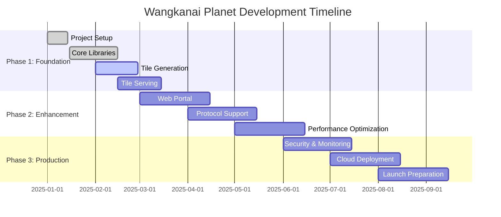

# Project Planning
## Wangkanai Planet - Development Roadmap & Planning

> **Version:** 1.0  
> **Date:** January 2025  
> **Last Updated:** January 2025

---

## 📋 Table of Contents

- [🎯 Project Overview](#-project-overview)
- [📅 Development Phases](#-development-phases)
- [🏗️ Milestone Planning](#️-milestone-planning)
- [📊 Resource Allocation](#-resource-allocation)
- [⚡ Sprint Planning](#-sprint-planning)
- [🔄 Risk Management](#-risk-management)
- [📈 Success Metrics](#-success-metrics)
- [🗓️ Timeline & Dependencies](#️-timeline--dependencies)
- [👥 Team Structure](#-team-structure)
- [📝 Delivery Strategy](#-delivery-strategy)

---

## 🎯 Project Overview

### Project Vision
Create a comprehensive, open-source geospatial tile serving platform that democratizes access to mapping technology while providing enterprise-grade performance and reliability.

### Project Mission
Deliver a lightweight, cross-platform solution that transforms complex geospatial datasets into web-optimized map tiles accessible through industry-standard protocols.

### Strategic Objectives
1. **Technical Excellence** - Build a high-performance, scalable platform
2. **Community Building** - Foster an active open-source community
3. **Standards Compliance** - Implement OGC and industry standards
4. **Market Penetration** - Achieve significant adoption in GIS community
5. **Sustainability** - Establish long-term project viability

---

## 📅 Development Phases

### Phase 1: Foundation (Months 1-3)
**Goal:** Establish core functionality and MVP

#### Objectives
- Core tile processing engine
- Basic file format support (GeoTIFF → MBTiles)
- Simple HTTP tile serving
- Console application interface
- Basic documentation

#### Key Deliverables
- [x] Project structure and build system
- [x] Core spatial processing library
- [x] Graphics processing foundation
- [ ] GeoTIFF input processing
- [ ] MBTiles output generation
- [ ] Basic tile serving API
- [ ] Console application
- [ ] Unit testing framework
- [ ] CI/CD pipeline

#### Success Criteria
- Convert 1GB GeoTIFF to MBTiles in < 30 seconds
- Serve tiles with < 200ms response time
- 80%+ test coverage
- Successful Docker deployment

### Phase 2: Enhancement (Months 4-6)
**Goal:** Expand functionality and improve user experience

#### Objectives
- Web portal development
- Multiple format support
- Protocol implementations (WMS, WMTS)
- Performance optimizations
- Advanced features

#### Key Deliverables
- [ ] Blazor web portal
- [ ] User authentication system
- [ ] Multiple input formats (GeoJSON, Shapefile)
- [ ] Multiple output formats (GeoPackage)
- [ ] WMS/WMTS protocol support
- [ ] Caching layer implementation
- [ ] Performance monitoring
- [ ] Advanced documentation

#### Success Criteria
- Support 5+ input formats
- Implement 3+ serving protocols
- Handle 100 concurrent users
- 95%+ uptime in testing
- Complete API documentation

### Phase 3: Production (Months 7-9)
**Goal:** Production readiness and market launch

#### Objectives
- Enterprise features
- Cloud deployment options
- Monitoring and observability
- Security hardening
- Community building

#### Key Deliverables
- [ ] Vector tile support
- [ ] Cloud deployment templates
- [ ] Monitoring dashboard
- [ ] Security audit and hardening
- [ ] Performance benchmarking
- [ ] Community resources
- [ ] Commercial support options

#### Success Criteria
- Pass security audit
- Deploy to major cloud platforms
- Achieve performance benchmarks
- Launch community program
- 500+ GitHub stars

---

## 🏗️ Milestone Planning

### Milestone 1: Core Engine (Month 1)
**Duration:** 4 weeks  
**Team Size:** 3 developers

#### Week 1: Foundation
- [x] Repository setup and structure
- [x] Build system configuration
- [x] Core project templates
- [x] Development environment setup

#### Week 2: Spatial Library
- [x] Coordinate system framework
- [x] GDAL integration layer
- [x] Basic geometry operations
- [ ] Coordinate transformations

#### Week 3: Graphics Library
- [ ] Image processing pipeline
- [ ] Format support framework
- [ ] Compression algorithms
- [ ] Memory optimization

#### Week 4: Integration & Testing
- [ ] End-to-end processing test
- [ ] Performance baseline
- [ ] Documentation updates
- [ ] Milestone review

**Deliverables:**
- Working spatial processing library
- Basic graphics processing capability
- Comprehensive unit tests
- Performance benchmarks

### Milestone 2: Tile Generation (Month 2)
**Duration:** 4 weeks  
**Team Size:** 4 developers

#### Week 1: Input Processing
- [ ] GeoTIFF reader implementation
- [ ] Metadata extraction
- [ ] Projection detection
- [ ] Data validation

#### Week 2: Tile Generation
- [ ] Tile pyramid algorithm
- [ ] Zoom level calculation
- [ ] Tile boundary computation
- [ ] Image resampling

#### Week 3: Output Generation
- [ ] MBTiles writer
- [ ] Tile storage optimization
- [ ] Metadata generation
- [ ] Compression options

#### Week 4: Console Application
- [ ] Command-line interface
- [ ] Progress reporting
- [ ] Error handling
- [ ] Configuration options

**Deliverables:**
- Complete tile generation workflow
- Console application
- Processing documentation
- Performance optimization

### Milestone 3: Tile Serving (Month 3)
**Duration:** 4 weeks  
**Team Size:** 4 developers

#### Week 1: HTTP Server
- [ ] ASP.NET Core setup
- [ ] Basic tile endpoints
- [ ] Request validation
- [ ] Error handling

#### Week 2: Caching Layer
- [ ] Memory caching
- [ ] Redis integration
- [ ] Cache policies
- [ ] Performance testing

#### Week 3: Protocol Support
- [ ] XYZ tile serving
- [ ] TMS implementation
- [ ] Basic WMS support
- [ ] Protocol validation

#### Week 4: Integration Testing
- [ ] End-to-end testing
- [ ] Load testing
- [ ] Client integration
- [ ] Documentation

**Deliverables:**
- Production-ready tile server
- Caching implementation
- Basic protocol support
- Integration tests

### Milestone 4: Web Portal (Month 4)
**Duration:** 4 weeks  
**Team Size:** 5 developers (3 backend, 2 frontend)

#### Week 1: Backend API
- [ ] REST API design
- [ ] Authentication system
- [ ] Database schema
- [ ] API documentation

#### Week 2: Frontend Framework
- [ ] Blazor application setup
- [ ] Component architecture
- [ ] State management
- [ ] Routing system

#### Week 3: Core Features
- [ ] File upload interface
- [ ] Processing job management
- [ ] Tile preview component
- [ ] User management

#### Week 4: Integration & Polish
- [ ] Frontend-backend integration
- [ ] UI/UX improvements
- [ ] Testing and debugging
- [ ] User documentation

**Deliverables:**
- Functional web portal
- User management system
- File processing interface
- Interactive tile viewer

---

## 📊 Resource Allocation

### Team Composition

#### Core Development Team
```yaml
Team Lead / Architect: 1 person
  - Overall technical direction
  - Architecture decisions
  - Code reviews
  - Team coordination

Senior Backend Developers: 2 people
  - Core engine development
  - API implementation
  - Performance optimization
  - System integration

Backend Developers: 2 people
  - Feature implementation
  - Testing
  - Documentation
  - Bug fixes

Frontend Developer: 1 person
  - Blazor application
  - User interface
  - Client integration
  - User experience

DevOps Engineer: 1 person
  - CI/CD pipeline
  - Deployment automation
  - Infrastructure management
  - Monitoring setup

QA Engineer: 1 person
  - Test planning
  - Quality assurance
  - Performance testing
  - Release validation
```

#### Extended Team (Phase 2+)
```yaml
Additional Developers: 2-3 people
  - Feature expansion
  - Protocol implementations
  - Platform integrations
  - Community contributions

Technical Writer: 1 person
  - Documentation
  - Tutorials
  - API references
  - User guides

Community Manager: 1 person
  - Community engagement
  - Issue management
  - Release communication
  - Developer relations
```

### Budget Allocation

#### Development Costs (9 months)
| Category | Monthly Cost | Total Cost | Percentage |
|----------|-------------|------------|------------|
| Development Team | $45,000 | $405,000 | 65% |
| Infrastructure | $2,000 | $18,000 | 3% |
| Tools & Licenses | $1,500 | $13,500 | 2% |
| Testing & QA | $5,000 | $45,000 | 7% |
| Marketing & Community | $3,000 | $27,000 | 4% |
| Contingency | $5,650 | $50,850 | 8% |
| Operations | $6,500 | $58,500 | 9% |
| **Total** | **$68,650** | **$617,850** | **100%** |

#### Infrastructure Costs
```yaml
Development Environment:
  - GitHub Enterprise: $4/user/month
  - Azure DevOps: $6/user/month
  - SonarCloud: $10/month
  - Docker Hub: $5/month

Testing Environment:
  - Azure Test Resources: $500/month
  - Load Testing Tools: $200/month
  - Security Scanning: $100/month

Production Demo:
  - Cloud Hosting: $300/month
  - Monitoring Tools: $100/month
  - CDN Services: $50/month
```

---

## ⚡ Sprint Planning

### Sprint Structure
- **Duration:** 2 weeks
- **Team Capacity:** 80 hours per developer per sprint
- **Sprint Goals:** 2-3 major features per sprint
- **Definition of Done:** Tested, documented, reviewed

### Sprint Template

#### Sprint Planning Meeting (2 hours)
1. **Review Previous Sprint** (30 minutes)
   - Demo completed features
   - Review metrics and feedback
   - Identify improvements

2. **Sprint Goal Setting** (30 minutes)
   - Define sprint objectives
   - Align with milestone goals
   - Set success criteria

3. **Story Estimation** (45 minutes)
   - Review and estimate user stories
   - Break down complex features
   - Assign story points

4. **Capacity Planning** (15 minutes)
   - Account for team availability
   - Consider technical debt
   - Plan testing activities

#### Daily Standups (15 minutes)
- What was accomplished yesterday?
- What will be worked on today?
- Are there any blockers?
- Sprint goal progress update

#### Sprint Review (1 hour)
- Demo completed features
- Gather stakeholder feedback
- Update product backlog
- Celebrate achievements

#### Sprint Retrospective (1 hour)
- What went well?
- What could be improved?
- Action items for next sprint
- Process improvements

### Example Sprint Backlog (Sprint 1)

#### Sprint Goal: Core Spatial Processing Foundation

| Story | Priority | Effort | Assignee | Status |
|-------|----------|--------|----------|--------|
| Implement coordinate system manager | High | 13 | Backend Dev 1 | ✅ Done |
| Add GDAL wrapper for file reading | High | 8 | Backend Dev 2 | ✅ Done |
| Create geometry transformation pipeline | Medium | 8 | Backend Dev 1 | 🔄 In Progress |
| Implement basic image processing | Medium | 5 | Backend Dev 2 | 📋 To Do |
| Setup continuous integration | High | 5 | DevOps | ✅ Done |
| Write developer documentation | Low | 3 | Tech Writer | 📋 To Do |

**Sprint Metrics:**
- **Total Points:** 42
- **Completed:** 26
- **Velocity:** 65%
- **Sprint Goal:** Achieved

---

## 🔄 Risk Management

### Risk Assessment Matrix

#### High Impact, High Probability
| Risk | Impact | Probability | Mitigation Strategy |
|------|--------|-------------|-------------------|
| Performance requirements not met | High | Medium | Early prototyping, continuous benchmarking |
| GDAL integration complexity | High | Medium | Proof of concept, expert consultation |
| Team member unavailability | High | Medium | Cross-training, documentation |

#### High Impact, Low Probability
| Risk | Impact | Probability | Mitigation Strategy |
|------|--------|-------------|-------------------|
| Major security vulnerability | High | Low | Security reviews, automated scanning |
| Legal/licensing issues | High | Low | Legal review, license auditing |
| Technology platform changes | High | Low | Multi-platform strategy |

#### Medium Impact, Various Probability
| Risk | Impact | Probability | Mitigation Strategy |
|------|--------|-------------|-------------------|
| Third-party dependencies | Medium | Medium | Vendor evaluation, alternatives |
| Market competition | Medium | Medium | Unique value proposition, community |
| Scope creep | Medium | High | Clear requirements, change control |

### Risk Mitigation Strategies

#### Technical Risks
```yaml
Performance Issues:
  - Early prototyping with real data
  - Continuous performance monitoring
  - Regular benchmark testing
  - Performance budgets per feature

Integration Complexity:
  - Spike solutions for complex integrations
  - Expert consultation and training
  - Incremental integration approach
  - Fallback options for critical dependencies

Security Vulnerabilities:
  - Regular security assessments
  - Automated vulnerability scanning
  - Security code reviews
  - Penetration testing
```

#### Project Risks
```yaml
Schedule Delays:
  - Buffer time in estimates
  - Regular progress reviews
  - Scope adjustment mechanisms
  - Priority-based delivery

Resource Constraints:
  - Cross-training team members
  - External contractor relationships
  - Flexible team scaling
  - Critical path optimization

Quality Issues:
  - Automated testing requirements
  - Code review standards
  - Quality gates in CI/CD
  - Regular quality audits
```

### Contingency Plans

#### Critical Path Delays
1. **Reassess Scope** - Remove non-critical features
2. **Increase Resources** - Add developers or extend hours
3. **Parallel Development** - Split features across teams
4. **External Help** - Engage consultants or contractors

#### Technical Blockers
1. **Alternative Solutions** - Research and implement alternatives
2. **Expert Consultation** - Engage domain experts
3. **Simplified Approach** - Reduce complexity temporarily
4. **External Libraries** - Use proven third-party solutions

---

## 📈 Success Metrics

### Key Performance Indicators (KPIs)

#### Technical Metrics
```yaml
Performance KPIs:
  - Tile generation: < 30 seconds per GB
  - Tile serving: < 200ms response time
  - Concurrent users: 100+ supported
  - Uptime: 99.5% availability

Quality KPIs:
  - Test coverage: > 80%
  - Bug rate: < 1 bug per 1000 lines of code
  - Code review coverage: 100%
  - Security scan score: > 95%

Scalability KPIs:
  - Horizontal scaling: 10x capacity increase
  - Memory efficiency: < 2GB for typical workload
  - Storage optimization: 50% compression ratio
  - Processing throughput: 10GB/hour
```

#### Project Metrics
```yaml
Delivery KPIs:
  - Sprint velocity: +/- 10% variance
  - Feature completion: 95% of planned features
  - Timeline adherence: +/- 1 week variance
  - Budget variance: +/- 5%

Community KPIs:
  - GitHub stars: 500+ by launch
  - Contributors: 10+ external contributors
  - Documentation: 100% API coverage
  - User adoption: 100+ installations
```

### Measurement Strategy

#### Automated Metrics Collection
```csharp
public class ProjectMetrics
{
    public class DevelopmentMetrics
    {
        public int LinesOfCode { get; set; }
        public double TestCoverage { get; set; }
        public int OpenIssues { get; set; }
        public int ClosedIssues { get; set; }
        public TimeSpan AveragePRReviewTime { get; set; }
    }
    
    public class PerformanceMetrics
    {
        public TimeSpan TileGenerationTime { get; set; }
        public TimeSpan TileResponseTime { get; set; }
        public int ConcurrentUsers { get; set; }
        public double UptimePercentage { get; set; }
    }
    
    public class CommunityMetrics
    {
        public int GitHubStars { get; set; }
        public int GitHubForks { get; set; }
        public int Contributors { get; set; }
        public int DownloadCount { get; set; }
    }
}
```

#### Reporting Dashboard
```yaml
Daily Metrics:
  - Build success rate
  - Test execution time
  - Code coverage changes
  - Issue resolution rate

Weekly Metrics:
  - Sprint progress
  - Velocity trends
  - Quality metrics
  - Performance benchmarks

Monthly Metrics:
  - Milestone progress
  - Budget tracking
  - Community growth
  - User feedback analysis
```

---

## 🗓️ Timeline & Dependencies

### Master Timeline



### Critical Dependencies

#### Technical Dependencies
```yaml
External Dependencies:
  - GDAL library integration
  - .NET 9.0 release stability
  - PostGIS extension availability
  - Docker base image updates

Internal Dependencies:
  - Spatial library completion
  - Graphics framework readiness
  - Database schema finalization
  - API design approval
```

#### Resource Dependencies
```yaml
Team Dependencies:
  - Senior developer availability
  - DevOps engineer onboarding
  - Frontend developer assignment
  - QA engineer training

Infrastructure Dependencies:
  - Development environment setup
  - Testing infrastructure provisioning
  - Production environment planning
  - Monitoring system configuration
```

### Dependency Management

#### Dependency Tracking
```yaml
Dependency Monitoring:
  - Weekly dependency review meetings
  - Automated dependency scanning
  - Version compatibility testing
  - Security vulnerability tracking

Risk Mitigation:
  - Alternative dependency options
  - Vendor lock-in prevention
  - Local dependency caching
  - Dependency update strategy
```

---

## 👥 Team Structure

### Organizational Chart

```
Project Sponsor
    |
Project Manager
    |
Technical Lead
    |
+-- Core Development Team
|   |-- Senior Backend Developers (2)
|   |-- Backend Developers (2)
|   |-- Frontend Developer (1)
|   
+-- Operations Team
|   |-- DevOps Engineer (1)
|   |-- QA Engineer (1)
|   
+-- Support Team
    |-- Technical Writer (1)
    |-- Community Manager (1)
```

### Roles and Responsibilities

#### Project Manager
- **Primary Focus:** Project coordination and delivery
- **Responsibilities:**
  - Sprint planning and execution
  - Stakeholder communication
  - Risk management
  - Budget tracking
  - Timeline management

#### Technical Lead
- **Primary Focus:** Technical architecture and direction
- **Responsibilities:**
  - Architecture decisions
  - Code review oversight
  - Technical standards enforcement
  - Team mentoring
  - External technical communication

#### Senior Backend Developers
- **Primary Focus:** Core platform development
- **Responsibilities:**
  - Complex feature implementation
  - Performance optimization
  - System integration
  - Junior developer mentoring
  - Technical problem solving

#### Backend Developers
- **Primary Focus:** Feature implementation and testing
- **Responsibilities:**
  - User story implementation
  - Unit test development
  - Bug fixing
  - Documentation writing
  - Code review participation

#### Frontend Developer
- **Primary Focus:** User interface and experience
- **Responsibilities:**
  - Blazor application development
  - User interface design
  - Client-side functionality
  - User experience optimization
  - Frontend testing

#### DevOps Engineer
- **Primary Focus:** Infrastructure and deployment automation
- **Responsibilities:**
  - CI/CD pipeline management
  - Infrastructure as code
  - Deployment automation
  - Monitoring and alerting
  - Security implementation

#### QA Engineer
- **Primary Focus:** Quality assurance and testing
- **Responsibilities:**
  - Test plan development
  - Manual testing execution
  - Automated test framework
  - Performance testing
  - Release validation

### Communication Plan

#### Regular Meetings
```yaml
Daily Standups:
  - Duration: 15 minutes
  - Participants: Development team
  - Purpose: Progress sync and blocker identification

Weekly Team Meetings:
  - Duration: 1 hour
  - Participants: Full team
  - Purpose: Sprint progress, technical discussions

Bi-weekly Planning:
  - Duration: 2 hours
  - Participants: Full team + stakeholders
  - Purpose: Sprint planning and review

Monthly Reviews:
  - Duration: 2 hours
  - Participants: Team + leadership
  - Purpose: Milestone review and planning
```

#### Communication Channels
```yaml
Synchronous:
  - Microsoft Teams for video calls
  - Slack for instant messaging
  - In-person meetings for complex discussions

Asynchronous:
  - Email for formal communication
  - GitHub for code-related discussions
  - Confluence for documentation
  - Slack for general updates
```

---

## 📝 Delivery Strategy

### Release Strategy

#### Release Types
```yaml
Development Releases:
  - Frequency: Weekly
  - Purpose: Internal testing and feedback
  - Distribution: Development team only
  - Version Format: 0.1.0-dev.20250107

Alpha Releases:
  - Frequency: Bi-weekly
  - Purpose: Early community feedback
  - Distribution: Selected community members
  - Version Format: 0.1.0-alpha.1

Beta Releases:
  - Frequency: Monthly
  - Purpose: Broader community testing
  - Distribution: Open beta program
  - Version Format: 0.1.0-beta.1

Release Candidates:
  - Frequency: Before major releases
  - Purpose: Final validation
  - Distribution: Full community
  - Version Format: 1.0.0-rc.1

Stable Releases:
  - Frequency: Quarterly
  - Purpose: Production use
  - Distribution: General availability
  - Version Format: 1.0.0
```

#### Release Process
```yaml
Release Preparation:
  1. Feature freeze (1 week before release)
  2. Testing and bug fixes
  3. Documentation updates
  4. Release notes preparation
  5. Security review

Release Execution:
  1. Final builds and testing
  2. Release artifact creation
  3. Documentation publishing
  4. Community announcement
  5. Distribution to channels

Post-Release:
  1. Monitoring and support
  2. Bug tracking and fixes
  3. User feedback collection
  4. Next release planning
```

### Deployment Strategy

#### Environment Progression
```yaml
Development Environment:
  - Purpose: Active development and testing
  - Update Frequency: Continuous
  - Validation: Automated tests only

Staging Environment:
  - Purpose: Integration testing and validation
  - Update Frequency: Daily builds
  - Validation: Automated + manual testing

Production Demo:
  - Purpose: Community demonstration
  - Update Frequency: Weekly releases
  - Validation: Full test suite + review

Customer Deployments:
  - Purpose: Production use
  - Update Frequency: Stable releases only
  - Validation: Complete release process
```

#### Rollback Strategy
```yaml
Automated Rollback:
  - Health check failures
  - Performance degradation
  - Error rate thresholds
  - Database connectivity issues

Manual Rollback:
  - Security vulnerabilities discovered
  - Critical functionality broken
  - Data integrity concerns
  - Customer escalation

Rollback Process:
  1. Immediate service restoration
  2. Root cause analysis
  3. Fix development and testing
  4. Controlled re-deployment
```

### Quality Gates

#### Code Quality Gates
```yaml
Pre-Commit:
  - Code formatting validation
  - Static analysis passing
  - Unit tests passing
  - Security scan clear

Pre-Merge:
  - Code review approval
  - Integration tests passing
  - Documentation updated
  - Breaking change analysis

Pre-Release:
  - Full test suite passing
  - Performance benchmarks met
  - Security audit complete
  - Documentation complete
```

#### Release Quality Gates
```yaml
Alpha Release:
  - Core functionality working
  - Basic documentation available
  - Known issues documented
  - Installation instructions

Beta Release:
  - Feature complete for scope
  - Performance requirements met
  - Security review passed
  - User documentation complete

Stable Release:
  - All test suites passing
  - Performance benchmarks achieved
  - Security certification
  - Production deployment tested
```

---

## 🎯 Future Planning

### Long-term Roadmap (1-3 years)

#### Year 1: Establishment
- **Q1-Q3:** Core platform development (covered above)
- **Q4:** Community building and adoption
  - Enterprise features development
  - Commercial support program
  - Partnership development
  - Conference presentations

#### Year 2: Expansion
- **Q1:** Advanced features and protocols
  - 3D terrain support
  - Vector tile styling
  - Real-time data integration
  - Mobile SDK development

- **Q2:** Cloud-native features
  - Kubernetes operators
  - Auto-scaling capabilities
  - Multi-cloud deployment
  - Serverless functions

- **Q3:** Enterprise integrations
  - LDAP/Active Directory
  - Enterprise databases
  - Business intelligence tools
  - Workflow automation

- **Q4:** AI/ML capabilities
  - Automatic data classification
  - Smart caching
  - Predictive scaling
  - Content optimization

#### Year 3: Maturation
- **Q1:** Platform ecosystem
  - Plugin marketplace
  - Third-party integrations
  - Certification program
  - Training materials

- **Q2:** Advanced analytics
  - Usage analytics
  - Performance insights
  - Capacity planning
  - Cost optimization

- **Q3:** Next-generation features
  - WebAssembly processing
  - Edge computing support
  - IoT integration
  - Augmented reality

- **Q4:** Market leadership
  - Industry standards participation
  - Thought leadership
  - Strategic partnerships
  - Global expansion

### Success Milestones

#### 6-Month Milestones
- [ ] MVP release with core functionality
- [ ] 100+ community members
- [ ] 5+ external contributors
- [ ] Performance benchmarks achieved

#### 1-Year Milestones
- [ ] Stable 1.0 release
- [ ] 1000+ GitHub stars
- [ ] 50+ production deployments
- [ ] Conference speaking engagements

#### 2-Year Milestones
- [ ] Enterprise customer base
- [ ] Platform ecosystem established
- [ ] Industry recognition achieved
- [ ] Sustainable business model

#### 3-Year Milestones
- [ ] Market leadership position
- [ ] Global community presence
- [ ] Strategic partnerships
- [ ] Next-generation platform

---

*This planning document serves as the guiding framework for the successful delivery of the Wangkanai Planet project, ensuring alignment between technical excellence and business objectives.*