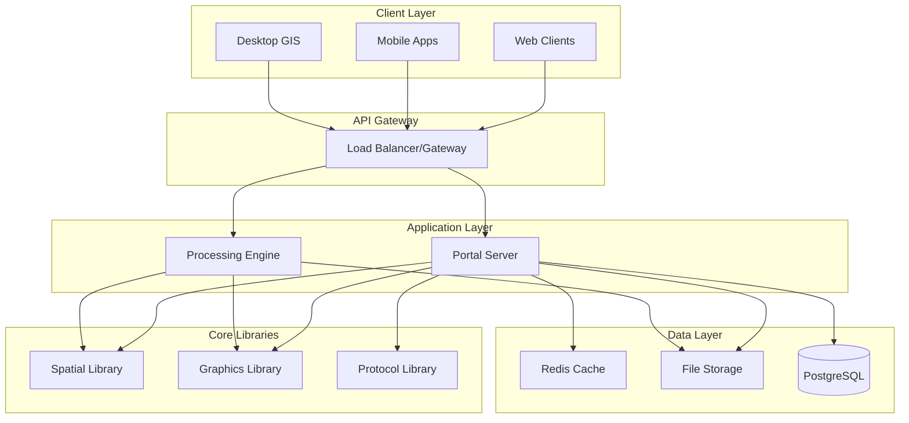

# Technical Specifications
## Wangkanai Planet - Planetary Distributed Map Service

> **Version:** 1.0  
> **Date:** January 2025  
> **Last Updated:** January 2025

---

## 📋 Table of Contents

- [🎯 System Overview](#-system-overview)
- [🏗️ Architecture Specifications](#️-architecture-specifications)
- [📊 Data Specifications](#-data-specifications)
- [🌐 Protocol Specifications](#-protocol-specifications)
- [🔧 API Specifications](#-api-specifications)
- [📦 Storage Specifications](#-storage-specifications)
- [🚀 Performance Specifications](#-performance-specifications)
- [🔒 Security Specifications](#-security-specifications)
- [🐳 Deployment Specifications](#-deployment-specifications)
- [📱 Client Integration](#-client-integration)

---

## 🎯 System Overview

Wangkanai Planet is a distributed geospatial tile serving platform designed to efficiently process, store, and serve map tiles through industry-standard protocols. The system consists of multiple components working together to provide a complete mapping solution.

### Core Capabilities
- **Data Processing** - Convert geospatial data to web-optimized tiles
- **Tile Serving** - Serve tiles via HTTP and OGC protocols
- **Format Support** - Handle multiple geospatial formats
- **Protocol Compliance** - Support WMS, WMTS, TMS standards
- **Scalability** - Horizontal scaling with load balancing

---

## 🏗️ Architecture Specifications

### System Architecture



### Component Specifications

#### Portal Server
- **Technology:** ASP.NET Core 9.0
- **UI Framework:** Blazor Server + WebAssembly Hybrid
- **Authentication:** ASP.NET Core Identity with JWT
- **Database:** Entity Framework Core with PostgreSQL/SQLite
- **Caching:** Redis for distributed caching

#### Processing Engine
- **Type:** Console Application (.NET 9.0)
- **Processing:** Multi-threaded tile generation
- **Memory Management:** Streaming for large datasets
- **Output Formats:** MBTiles, GeoPackage, File System
- **Coordination:** Message queue for job distribution

#### Core Libraries
- **Spatial Processing:** Coordinate transformations, projections
- **Graphics Processing:** Image manipulation, format conversion
- **Protocol Implementation:** WMS, WMTS, TMS compliance
- **Extension Framework:** Plugin architecture for custom formats

---

## 📊 Data Specifications

### Input Data Formats

#### Raster Formats
| Format | Extension | MIME Type | Max Size | Compression |
|--------|-----------|-----------|----------|-------------|
| GeoTIFF | .tif, .tiff | image/tiff | 10 GB | LZW, JPEG, ZIP |
| JPEG | .jpg, .jpeg | image/jpeg | 100 MB | JPEG |
| PNG | .png | image/png | 500 MB | PNG |
| WebP | .webp | image/webp | 200 MB | WebP |
| HEIF | .heic, .heif | image/heif | 200 MB | HEVC |

#### Vector Formats
| Format | Extension | MIME Type | Max Records | Features |
|--------|-----------|-----------|-------------|----------|
| GeoJSON | .geojson | application/geo+json | 1M | Points, Lines, Polygons |
| Shapefile | .shp | application/octet-stream | 2M | Complete geometries |
| KML | .kml | application/vnd.google-earth.kml | 500K | Google Earth format |
| GPX | .gpx | application/gpx+xml | 100K | GPS tracks |

#### Metadata Requirements
```json
{
  "spatial_reference": {
    "epsg_code": 4326,
    "proj4_string": "+proj=longlat +datum=WGS84 +no_defs",
    "well_known_text": "GEOGCS[\"WGS 84\",...]"
  },
  "bounds": {
    "min_x": -180.0,
    "min_y": -85.0511,
    "max_x": 180.0,
    "max_y": 85.0511
  },
  "resolution": {
    "pixels_per_unit": 1.0,
    "units": "degrees"
  }
}
```

### Output Tile Formats

#### Tile Specifications
| Parameter | Value | Description |
|-----------|-------|-------------|
| Tile Size | 256x256 pixels | Standard web mercator tile size |
| Zoom Levels | 0-22 | From global view to street level |
| Projection | EPSG:3857 | Web Mercator projection |
| Origin | Top-left | Standard tile origin |
| Format | PNG, JPEG, WebP | Configurable output format |

#### Tile Coordinate System
```
Zoom Level 0: 1 tile (256x256)
Zoom Level 1: 4 tiles (2x2 grid)
Zoom Level 2: 16 tiles (4x4 grid)
...
Zoom Level n: 4^n tiles (2^n x 2^n grid)
```

#### URL Template Patterns
```
# XYZ Format
/tiles/{z}/{x}/{y}.{format}

# TMS Format  
/tiles/{z}/{x}/{y_inverted}.{format}

# QuadKey Format
/tiles/{quadkey}.{format}
```

---

## 🌐 Protocol Specifications

### Web Map Service (WMS) 1.3.0

#### GetCapabilities Request
```http
GET /wms?SERVICE=WMS&REQUEST=GetCapabilities&VERSION=1.3.0
```

#### GetMap Request
```http
GET /wms?SERVICE=WMS&REQUEST=GetMap&VERSION=1.3.0
    &LAYERS=layer_name
    &STYLES=default
    &CRS=EPSG:4326
    &BBOX=minx,miny,maxx,maxy
    &WIDTH=800
    &HEIGHT=600
    &FORMAT=image/png
```

#### Supported Parameters
| Parameter | Required | Values | Description |
|-----------|----------|---------|-------------|
| SERVICE | Yes | WMS | Service type |
| REQUEST | Yes | GetCapabilities, GetMap | Request type |
| VERSION | Yes | 1.3.0 | WMS version |
| LAYERS | Yes | layer_name | Layer identifier |
| CRS | Yes | EPSG:4326, EPSG:3857 | Coordinate reference system |
| BBOX | Yes | minx,miny,maxx,maxy | Bounding box |
| WIDTH | Yes | 1-2048 | Image width in pixels |
| HEIGHT | Yes | 1-2048 | Image height in pixels |
| FORMAT | Yes | image/png, image/jpeg | Output format |

### Web Map Tile Service (WMTS) 1.0.0

#### GetCapabilities Request
```http
GET /wmts?SERVICE=WMTS&REQUEST=GetCapabilities&VERSION=1.0.0
```

#### GetTile Request
```http
GET /wmts?SERVICE=WMTS&REQUEST=GetTile&VERSION=1.0.0
    &LAYER=layer_name
    &STYLE=default
    &TILEMATRIXSET=WebMercatorQuad
    &TILEMATRIX=zoom_level
    &TILEROW=row
    &TILECOL=col
    &FORMAT=image/png
```

#### RESTful WMTS
```http
GET /wmts/1.0.0/{layer}/{style}/{tilematrixset}/{z}/{y}/{x}.{format}
```

### Tile Map Service (TMS)

#### Service Metadata
```http
GET /tms/1.0.0/
```

#### Layer Metadata  
```http
GET /tms/1.0.0/{layer}/
```

#### Tile Request
```http
GET /tms/1.0.0/{layer}/{z}/{x}/{y}.{format}
```

---

## 🔧 API Specifications

### REST API Endpoints

#### Tile Management API

##### Upload Dataset
```http
POST /api/datasets
Content-Type: multipart/form-data

{
  "file": binary_data,
  "name": "dataset_name",
  "description": "Dataset description",
  "tags": ["tag1", "tag2"]
}
```

##### Process Dataset
```http
POST /api/datasets/{id}/process
Content-Type: application/json

{
  "output_format": "mbtiles",
  "zoom_levels": {
    "min": 0,
    "max": 18
  },
  "tile_format": "png",
  "compression": "gzip"
}
```

##### Get Processing Status
```http
GET /api/jobs/{job_id}

Response:
{
  "id": "job_id",
  "status": "processing|completed|failed",
  "progress": 75.5,
  "started_at": "2025-01-01T00:00:00Z",
  "estimated_completion": "2025-01-01T00:30:00Z",
  "error_message": null
}
```

#### Layer Management API

##### List Layers
```http
GET /api/layers?page=1&size=20&search=term

Response:
{
  "data": [
    {
      "id": "layer_id",
      "name": "Layer Name",
      "description": "Layer description",
      "bounds": [-180, -85, 180, 85],
      "zoom_levels": [0, 18],
      "formats": ["png", "jpeg"],
      "created_at": "2025-01-01T00:00:00Z"
    }
  ],
  "pagination": {
    "page": 1,
    "size": 20,
    "total": 100,
    "pages": 5
  }
}
```

##### Get Layer Details
```http
GET /api/layers/{layer_id}

Response:
{
  "id": "layer_id",
  "name": "Layer Name",
  "description": "Layer description",
  "bounds": [-180, -85, 180, 85],
  "zoom_levels": [0, 18],
  "tile_formats": ["png", "jpeg"],
  "projection": "EPSG:3857",
  "tile_size": 256,
  "metadata": {
    "source": "source_info",
    "license": "license_info",
    "attribution": "attribution_text"
  },
  "statistics": {
    "tile_count": 1048576,
    "file_size": "2.5 GB",
    "last_updated": "2025-01-01T00:00:00Z"
  }
}
```

#### Tile Serving API

##### Get Tile
```http
GET /api/tiles/{layer_id}/{z}/{x}/{y}.{format}

Headers:
- Cache-Control: public, max-age=3600
- ETag: "tile_hash"
- Content-Type: image/png
- Content-Length: 1024
```

##### Get Tile Info
```http
GET /api/tiles/{layer_id}/{z}/{x}/{y}/info

Response:
{
  "coordinates": {
    "z": 10,
    "x": 512,
    "y": 384
  },
  "bounds": {
    "min_x": -1.23,
    "min_y": 51.45,
    "max_x": -1.20,
    "max_y": 51.48
  },
  "size": 1024,
  "format": "png",
  "last_modified": "2025-01-01T00:00:00Z"
}
```

### WebSocket API

#### Real-time Processing Updates
```javascript
// Connect to WebSocket
const ws = new WebSocket('wss://api.example.com/ws/jobs');

// Subscribe to job updates
ws.send(JSON.stringify({
  action: 'subscribe',
  job_id: 'job_123'
}));

// Receive updates
ws.onmessage = (event) => {
  const update = JSON.parse(event.data);
  console.log(`Job ${update.job_id}: ${update.progress}%`);
};
```

---

## 📦 Storage Specifications

### File Storage Structure

#### Tile Storage Layout
```
tiles/
├── {layer_id}/
│   ├── metadata.json
│   ├── 0/
│   │   └── 0/
│   │       └── 0.png
│   ├── 1/
│   │   ├── 0/
│   │   │   ├── 0.png
│   │   │   └── 1.png
│   │   └── 1/
│   │       ├── 0.png
│   │       └── 1.png
│   └── ...
```

#### MBTiles Database Schema
```sql
CREATE TABLE metadata (
    name TEXT,
    value TEXT
);

CREATE TABLE tiles (
    zoom_level INTEGER,
    tile_column INTEGER,
    tile_row INTEGER,
    tile_data BLOB,
    PRIMARY KEY (zoom_level, tile_column, tile_row)
);

CREATE INDEX tiles_index ON tiles (zoom_level, tile_column, tile_row);
```

#### GeoPackage Schema Extensions
```sql
-- Standard GeoPackage tables
CREATE TABLE gpkg_contents (...);
CREATE TABLE gpkg_spatial_ref_sys (...);
CREATE TABLE gpkg_tile_matrix_set (...);
CREATE TABLE gpkg_tile_matrix (...);

-- Custom Planet extensions
CREATE TABLE planet_layer_metadata (
    layer_id TEXT PRIMARY KEY,
    processing_options TEXT,
    created_at DATETIME,
    updated_at DATETIME
);
```

### Database Specifications

#### PostgreSQL Schema
```sql
-- Users and Authentication
CREATE TABLE users (
    id UUID PRIMARY KEY DEFAULT gen_random_uuid(),
    username VARCHAR(50) UNIQUE NOT NULL,
    email VARCHAR(255) UNIQUE NOT NULL,
    password_hash VARCHAR(255) NOT NULL,
    created_at TIMESTAMPTZ DEFAULT NOW(),
    updated_at TIMESTAMPTZ DEFAULT NOW()
);

-- Datasets
CREATE TABLE datasets (
    id UUID PRIMARY KEY DEFAULT gen_random_uuid(),
    name VARCHAR(255) NOT NULL,
    description TEXT,
    file_path VARCHAR(500) NOT NULL,
    file_size BIGINT NOT NULL,
    mime_type VARCHAR(100) NOT NULL,
    status VARCHAR(20) DEFAULT 'uploaded',
    created_by UUID REFERENCES users(id),
    created_at TIMESTAMPTZ DEFAULT NOW(),
    updated_at TIMESTAMPTZ DEFAULT NOW()
);

-- Layers
CREATE TABLE layers (
    id UUID PRIMARY KEY DEFAULT gen_random_uuid(),
    dataset_id UUID REFERENCES datasets(id),
    name VARCHAR(255) NOT NULL,
    description TEXT,
    bounds GEOMETRY(POLYGON, 4326),
    min_zoom INTEGER DEFAULT 0,
    max_zoom INTEGER DEFAULT 18,
    tile_format VARCHAR(10) DEFAULT 'png',
    status VARCHAR(20) DEFAULT 'processing',
    metadata JSONB,
    created_at TIMESTAMPTZ DEFAULT NOW(),
    updated_at TIMESTAMPTZ DEFAULT NOW()
);

-- Processing Jobs
CREATE TABLE processing_jobs (
    id UUID PRIMARY KEY DEFAULT gen_random_uuid(),
    dataset_id UUID REFERENCES datasets(id),
    layer_id UUID REFERENCES layers(id),
    status VARCHAR(20) DEFAULT 'queued',
    progress DECIMAL(5,2) DEFAULT 0.0,
    started_at TIMESTAMPTZ,
    completed_at TIMESTAMPTZ,
    error_message TEXT,
    options JSONB,
    created_at TIMESTAMPTZ DEFAULT NOW(),
    updated_at TIMESTAMPTZ DEFAULT NOW()
);

-- Indexes
CREATE INDEX idx_datasets_created_by ON datasets(created_by);
CREATE INDEX idx_layers_dataset_id ON layers(dataset_id);
CREATE INDEX idx_layers_bounds ON layers USING GIST(bounds);
CREATE INDEX idx_jobs_status ON processing_jobs(status);
CREATE INDEX idx_jobs_created_at ON processing_jobs(created_at);
```

---

## 🚀 Performance Specifications

### Performance Requirements

#### Response Time Targets
| Operation | Target | Maximum | Percentile |
|-----------|--------|---------|------------|
| Tile Request (Cached) | < 50ms | < 200ms | 95th |
| Tile Request (Generated) | < 500ms | < 2s | 90th |
| API Request | < 100ms | < 500ms | 95th |
| File Upload | < 1s/MB | < 5s/MB | 90th |
| Dataset Processing | < 30s/GB | < 2min/GB | 90th |

#### Throughput Requirements
| Metric | Target | Peak |
|--------|--------|------|
| Concurrent Tile Requests | 1,000 req/s | 5,000 req/s |
| Concurrent Users | 100 users | 500 users |
| File Processing Queue | 10 jobs | 50 jobs |
| Database Connections | 50 connections | 200 connections |

#### Resource Specifications
| Resource | Minimum | Recommended | Maximum |
|----------|---------|-------------|---------|
| CPU | 2 cores | 8 cores | 32 cores |
| RAM | 4 GB | 16 GB | 128 GB |
| Storage | 100 GB | 1 TB | 10 TB |
| Network | 100 Mbps | 1 Gbps | 10 Gbps |

### Caching Strategy

#### Cache Hierarchy
```
Client Browser Cache (1 hour)
    ↓
CDN/Proxy Cache (24 hours)
    ↓
Application Cache (Redis - 1 week)
    ↓
File System Cache (Persistent)
    ↓
Database/Storage
```

#### Cache Headers
```http
# For static tiles
Cache-Control: public, max-age=86400, immutable
ETag: "tile_hash_value"
Last-Modified: Wed, 01 Jan 2025 00:00:00 GMT

# For dynamic content
Cache-Control: public, max-age=3600, must-revalidate
Vary: Accept-Encoding
```

---

## 🔒 Security Specifications

### Authentication & Authorization

#### JWT Token Structure
```json
{
  "header": {
    "alg": "RS256",
    "typ": "JWT"
  },
  "payload": {
    "sub": "user_id",
    "name": "User Name",
    "email": "user@example.com",
    "roles": ["user", "admin"],
    "permissions": ["read:tiles", "write:layers"],
    "iat": 1640995200,
    "exp": 1640998800,
    "iss": "planet.wangkanai.com",
    "aud": "planet-api"
  }
}
```

#### API Key Authentication
```http
# Header-based
Authorization: Bearer api_key_here

# Query parameter (discouraged)
GET /api/tiles/layer/1/0/0.png?api_key=key_here
```

#### Role-Based Access Control
```yaml
roles:
  viewer:
    permissions:
      - read:tiles
      - read:layers
  editor:
    permissions:
      - read:tiles
      - read:layers
      - write:layers
  admin:
    permissions:
      - read:*
      - write:*
      - delete:*
```

### Data Protection

#### Encryption Standards
- **At Rest:** AES-256 encryption for sensitive data
- **In Transit:** TLS 1.3 for all communications
- **Key Management:** Azure Key Vault or AWS KMS
- **Database:** Transparent Data Encryption (TDE)

#### Input Validation
```csharp
public class TileRequest
{
    [Range(0, 22)]
    public int Z { get; set; }
    
    [Range(0, int.MaxValue)]
    public int X { get; set; }
    
    [Range(0, int.MaxValue)]
    public int Y { get; set; }
    
    [RegularExpression(@"^[a-zA-Z0-9_-]+$")]
    [StringLength(100)]
    public string LayerId { get; set; }
    
    [AllowedValues("png", "jpeg", "webp")]
    public string Format { get; set; } = "png";
}
```

---

## 🐳 Deployment Specifications

### Container Specifications

#### Docker Images
```dockerfile
# Base image specifications
FROM mcr.microsoft.com/dotnet/aspnet:9.0-alpine AS base
WORKDIR /app
EXPOSE 80
EXPOSE 443

# Resource limits
LABEL com.wangkanai.planet.version="1.0.0"
LABEL com.wangkanai.planet.component="portal"

# Health check
HEALTHCHECK --interval=30s --timeout=10s --start-period=60s --retries=3 \
    CMD curl -f http://localhost/health || exit 1
```

#### Kubernetes Deployment
```yaml
apiVersion: apps/v1
kind: Deployment
metadata:
  name: planet-portal
  labels:
    app: planet-portal
spec:
  replicas: 3
  selector:
    matchLabels:
      app: planet-portal
  template:
    metadata:
      labels:
        app: planet-portal
    spec:
      containers:
      - name: portal
        image: wangkanai/planet-portal:1.0.0
        ports:
        - containerPort: 80
        env:
        - name: ASPNETCORE_ENVIRONMENT
          value: "Production"
        - name: ConnectionStrings__DefaultConnection
          valueFrom:
            secretKeyRef:
              name: planet-secrets
              key: database-connection
        resources:
          requests:
            memory: "512Mi"
            cpu: "250m"
          limits:
            memory: "2Gi"
            cpu: "1000m"
        livenessProbe:
          httpGet:
            path: /health
            port: 80
          initialDelaySeconds: 30
          periodSeconds: 30
        readinessProbe:
          httpGet:
            path: /health/ready
            port: 80
          initialDelaySeconds: 5
          periodSeconds: 10
```

### Environment Configuration

#### Environment Variables
```env
# Application
ASPNETCORE_ENVIRONMENT=Production
ASPNETCORE_URLS=http://+:80;https://+:443

# Database
ConnectionStrings__DefaultConnection=Host=db;Database=planet;Username=planet;Password=***

# Redis Cache
ConnectionStrings__Redis=redis:6379

# Storage
Storage__Type=FileSystem
Storage__Path=/app/data/tiles
Storage__MaxFileSize=10737418240

# Processing
Processing__MaxConcurrentJobs=5
Processing__TempDirectory=/tmp/planet
Processing__MaxZoomLevel=18

# Logging
Logging__LogLevel__Default=Information
Logging__LogLevel__Wangkanai.Planet=Debug

# Security
Security__JwtSecretKey=***
Security__JwtExpirationMinutes=15
Security__RequireHttps=true
```

---

## 📱 Client Integration

### JavaScript SDK

#### Basic Usage
```javascript
import { PlanetClient } from '@wangkanai/planet-js';

const client = new PlanetClient({
  baseUrl: 'https://api.planet.wangkanai.com',
  apiKey: 'your_api_key_here'
});

// Get layer information
const layer = await client.layers.get('layer_id');

// Get tile URL
const tileUrl = client.tiles.getUrl('layer_id', z, x, y, 'png');

// Upload dataset
const dataset = await client.datasets.upload(file, {
  name: 'My Dataset',
  description: 'Dataset description'
});
```

#### Leaflet Integration
```javascript
import L from 'leaflet';
import { PlanetTileLayer } from '@wangkanai/planet-leaflet';

const map = L.map('map').setView([51.505, -0.09], 13);

const planetLayer = new PlanetTileLayer('layer_id', {
  baseUrl: 'https://tiles.planet.wangkanai.com',
  apiKey: 'your_api_key',
  attribution: '© Planet Tiles'
});

planetLayer.addTo(map);
```

### Mobile SDK Integration

#### Android (Kotlin)
```kotlin
import com.wangkanai.planet.PlanetMapView
import com.wangkanai.planet.TileLayer

class MapActivity : AppCompatActivity() {
    private lateinit var mapView: PlanetMapView
    
    override fun onCreate(savedInstanceState: Bundle?) {
        super.onCreate(savedInstanceState)
        
        mapView = PlanetMapView(this).apply {
            configure {
                baseUrl = "https://tiles.planet.wangkanai.com"
                apiKey = "your_api_key"
            }
        }
        
        val tileLayer = TileLayer("layer_id")
        mapView.addLayer(tileLayer)
        
        setContentView(mapView)
    }
}
```

#### iOS (Swift)
```swift
import PlanetMapKit

class MapViewController: UIViewController {
    private var mapView: PlanetMapView!
    
    override func viewDidLoad() {
        super.viewDidLoad()
        
        mapView = PlanetMapView(frame: view.bounds)
        mapView.configure(
            baseUrl: "https://tiles.planet.wangkanai.com",
            apiKey: "your_api_key"
        )
        
        let tileLayer = PlanetTileLayer(layerId: "layer_id")
        mapView.addLayer(tileLayer)
        
        view.addSubview(mapView)
    }
}
```

---

## 📊 Monitoring & Observability

### Metrics Collection

#### Application Metrics
```yaml
metrics:
  - name: planet_tile_requests_total
    type: counter
    labels: [layer_id, format, cache_hit]
    
  - name: planet_tile_response_duration
    type: histogram
    buckets: [0.01, 0.05, 0.1, 0.5, 1, 2, 5]
    labels: [layer_id, format]
    
  - name: planet_processing_jobs_active
    type: gauge
    labels: [status]
    
  - name: planet_storage_size_bytes
    type: gauge
    labels: [layer_id, storage_type]
```

#### Health Check Endpoints
```http
# Basic health check
GET /health
Response: {"status": "Healthy", "timestamp": "2025-01-01T00:00:00Z"}

# Detailed health check
GET /health/detailed
Response: {
  "status": "Healthy",
  "checks": {
    "database": "Healthy",
    "redis": "Healthy", 
    "storage": "Healthy",
    "external_services": "Degraded"
  },
  "timestamp": "2025-01-01T00:00:00Z"
}
```

### Logging Standards

#### Structured Logging Format
```json
{
  "timestamp": "2025-01-01T00:00:00.000Z",
  "level": "Information",
  "category": "Wangkanai.Planet.TileController",
  "message": "Tile request processed successfully",
  "properties": {
    "layerId": "layer_123",
    "tileCoordinates": { "z": 10, "x": 512, "y": 384 },
    "format": "png",
    "cacheHit": true,
    "responseTime": 45,
    "userId": "user_456",
    "requestId": "req_789"
  }
}
```

---

*This technical specification document serves as the authoritative reference for all technical implementation details of the Wangkanai Planet system.*