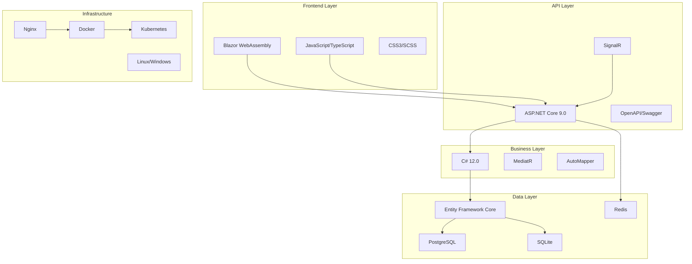

# Technology Stack
## Wangkanai Planet - Technical Stack Overview

> **Version:** 1.0  
> **Date:** January 2025  
> **Last Updated:** January 2025

---

## 📋 Table of Contents

- [🎯 Stack Overview](#-stack-overview)
- [⚙️ Core Technologies](#️-core-technologies)
- [🌐 Web Technologies](#-web-technologies)
- [📊 Data Technologies](#-data-technologies)
- [🐳 Infrastructure & DevOps](#-infrastructure--devops)
- [🧪 Testing & Quality](#-testing--quality)
- [🔧 Development Tools](#-development-tools)
- [📦 Package Management](#-package-management)
- [🚀 Deployment Stack](#-deployment-stack)
- [📈 Monitoring & Observability](#-monitoring--observability)

---

## 🎯 Stack Overview

The Wangkanai Planet technology stack is built on modern, cross-platform technologies that provide high performance, scalability, and maintainability for geospatial data processing and tile serving applications.

### Architecture Layers



### Technology Selection Criteria

#### Primary Criteria
- **Performance** - High-throughput geospatial processing
- **Cross-Platform** - Windows, Linux, macOS compatibility
- **Scalability** - Horizontal scaling capabilities
- **Maintainability** - Long-term support and community
- **Standards Compliance** - OGC and industry standards

#### Secondary Criteria
- **Developer Experience** - Productivity and tooling
- **Community Support** - Active ecosystem and documentation
- **Security** - Built-in security features
- **Cost Effectiveness** - Open source and cost-efficient

---

## ⚙️ Core Technologies

### .NET Ecosystem

#### .NET 9.0 Runtime
```yaml
Technology: .NET 9.0
Purpose: Core runtime and framework
Key Features:
  - Cross-platform (Windows, Linux, macOS)
  - High performance with AOT compilation
  - Advanced garbage collection
  - Native library interop (P/Invoke)
  - Superior memory management
  
Justification:
  - Latest LTS with long-term support
  - Best-in-class performance for server workloads
  - Excellent tooling and debugging support
  - Strong ecosystem for geospatial libraries
```

#### C# 12.0 Language
```csharp
// Modern C# features used in the project
public record TileRequest(int X, int Y, int Z, string Format);

public class TileGenerator
{
    // Primary constructors
    public TileGenerator(ILogger<TileGenerator> logger) 
        => Logger = logger;
    
    // Pattern matching
    public async Task<TileResult> ProcessAsync(TileRequest request) => request switch
    {
        { Z: < 0 } => throw new ArgumentException("Invalid zoom level"),
        { Format: not ("png" or "jpeg" or "webp") } => throw new ArgumentException("Unsupported format"),
        _ => await GenerateTileAsync(request)
    };
    
    // Collection expressions
    public string[] SupportedFormats => ["png", "jpeg", "webp", "avif"];
}
```

### Geospatial Libraries

#### GDAL (Geospatial Data Abstraction Library)
```yaml
Technology: GDAL 3.8+
Purpose: Geospatial data reading, writing, and processing
Integration: Native bindings via P/Invoke
Key Features:
  - 200+ raster and vector formats
  - Coordinate system transformations
  - Raster processing and analysis
  - Command-line utilities integration

Usage Example:
  Input: GeoTIFF files up to 10GB
  Processing: Tile pyramid generation
  Output: Web Mercator tiles (256x256)
```

#### Proj (Cartographic Projections Library)
```yaml
Technology: Proj 9.3+
Purpose: Coordinate reference system transformations
Key Features:
  - EPSG database with 6000+ coordinate systems
  - High-precision transformations
  - Grid-based datum shifts
  - Custom CRS definition support

Common Transformations:
  - WGS84 (EPSG:4326) → Web Mercator (EPSG:3857)
  - UTM zones → Geographic coordinates
  - Local projections → Global standards
```

---

## 🌐 Web Technologies

### ASP.NET Core Stack

#### ASP.NET Core 9.0
```yaml
Technology: ASP.NET Core 9.0
Purpose: Web API and server framework
Key Features:
  - High-performance HTTP server (Kestrel)
  - Built-in dependency injection
  - Middleware pipeline
  - OpenAPI/Swagger integration
  - Rate limiting and caching
  
Performance Characteristics:
  - 7M+ requests/second (plaintext)
  - <1ms latency for cached responses
  - Automatic GZip compression
  - HTTP/2 and HTTP/3 support
```

#### Blazor WebAssembly
```razor
@* Modern Blazor component example *@
@page "/map/{LayerId}"
@using Wangkanai.Planet.Client.Components

<PageTitle>Map Viewer - @LayerId</PageTitle>

<div class="map-container">
    <MapComponent LayerId="@LayerId" 
                  OnTileClick="@HandleTileClick"
                  ZoomLevel="@InitialZoom" />
    
    <LayerControls @bind-Visible="@ShowControls" 
                   OnLayerChanged="@RefreshMap" />
</div>

@code {
    [Parameter] public string LayerId { get; set; }
    [Inject] private IMapService MapService { get; set; }
    
    private int InitialZoom = 10;
    private bool ShowControls = true;
    
    private async Task HandleTileClick(TileClickEventArgs args)
    {
        var tileInfo = await MapService.GetTileInfoAsync(args.X, args.Y, args.Z);
        // Handle tile interaction
    }
}
```

#### SignalR Hub
```csharp
[Authorize]
public class ProcessingHub : Hub
{
    private readonly IJobService _jobService;
    
    public ProcessingHub(IJobService jobService)
    {
        _jobService = jobService;
    }
    
    public async Task SubscribeToJob(string jobId)
    {
        await Groups.AddToGroupAsync(Context.ConnectionId, $"job-{jobId}");
        
        var status = await _jobService.GetStatusAsync(jobId);
        await Clients.Caller.SendAsync("JobStatus", status);
    }
    
    public async Task UnsubscribeFromJob(string jobId)
    {
        await Groups.RemoveFromGroupAsync(Context.ConnectionId, $"job-{jobId}");
    }
}
```

### Frontend Technologies

#### JavaScript/TypeScript Integration
```javascript
// Modern ES6+ JavaScript for map interaction
export class PlanetMapClient {
    constructor(baseUrl, apiKey) {
        this.baseUrl = baseUrl;
        this.apiKey = apiKey;
        this.cache = new Map();
    }
    
    async getTile(layerId, x, y, z, format = 'png') {
        const cacheKey = `${layerId}-${x}-${y}-${z}-${format}`;
        
        if (this.cache.has(cacheKey)) {
            return this.cache.get(cacheKey);
        }
        
        const url = `${this.baseUrl}/api/tiles/${layerId}/${z}/${x}/${y}.${format}`;
        const response = await fetch(url, {
            headers: {
                'Authorization': `Bearer ${this.apiKey}`,
                'Accept': `image/${format}`
            }
        });
        
        if (!response.ok) {
            throw new Error(`Failed to fetch tile: ${response.status}`);
        }
        
        const blob = await response.blob();
        this.cache.set(cacheKey, blob);
        
        return blob;
    }
    
    // WebSocket connection for real-time updates
    connectToProcessingUpdates() {
        const connection = new signalR.HubConnectionBuilder()
            .withUrl(`${this.baseUrl}/hubs/processing`)
            .build();
            
        connection.start().then(() => {
            console.log('Connected to processing hub');
        });
        
        return connection;
    }
}
```

#### CSS3/SCSS Styling
```scss
// Modern SCSS with CSS Grid and Flexbox
.map-container {
  display: grid;
  grid-template-areas: 
    "map controls"
    "map status";
  grid-template-columns: 1fr 300px;
  grid-template-rows: 1fr auto;
  height: 100vh;
  gap: 1rem;
  
  .map-component {
    grid-area: map;
    position: relative;
    border-radius: 8px;
    overflow: hidden;
    box-shadow: 0 4px 6px rgba(0, 0, 0, 0.1);
    
    &__loading {
      position: absolute;
      top: 50%;
      left: 50%;
      transform: translate(-50%, -50%);
      
      .spinner {
        width: 40px;
        height: 40px;
        border: 4px solid #e3f2fd;
        border-top: 4px solid #2196f3;
        border-radius: 50%;
        animation: spin 1s linear infinite;
      }
    }
  }
  
  @keyframes spin {
    0% { transform: translate(-50%, -50%) rotate(0deg); }
    100% { transform: translate(-50%, -50%) rotate(360deg); }
  }
}

// CSS custom properties for theming
:root {
  --primary-color: #2196f3;
  --secondary-color: #ff9800;
  --error-color: #f44336;
  --success-color: #4caf50;
  --warning-color: #ff9800;
  
  --font-family: 'Inter', system-ui, sans-serif;
  --border-radius: 8px;
  --spacing-unit: 0.5rem;
}
```

---

## 📊 Data Technologies

### Database Technologies

#### PostgreSQL 16
```yaml
Technology: PostgreSQL 16
Purpose: Primary relational database
Extensions:
  - PostGIS 3.4 (spatial data support)
  - pg_stat_statements (query performance)
  - uuid-ossp (UUID generation)

Key Features:
  - ACID compliance
  - Advanced spatial indexing (GiST, SP-GiST)
  - JSON/JSONB support
  - Partitioning and replication
  - Full-text search
  
Performance Characteristics:
  - 50,000+ transactions/second
  - Parallel query execution
  - Advanced query optimizer
  - Connection pooling support
```

```sql
-- Example spatial queries with PostGIS
CREATE EXTENSION IF NOT EXISTS postgis;

-- Spatial index for efficient tile queries
CREATE INDEX idx_layers_bounds_gist 
ON layers USING GIST(bounds);

-- Find layers intersecting with a bounding box
SELECT l.id, l.name, ST_Area(l.bounds) as area
FROM layers l
WHERE ST_Intersects(
    l.bounds, 
    ST_MakeEnvelope(-122.5, 37.7, -122.3, 37.8, 4326)
)
ORDER BY area DESC;

-- Calculate tile coverage statistics
WITH tile_stats AS (
    SELECT 
        layer_id,
        COUNT(*) as tile_count,
        SUM(file_size) as total_size,
        AVG(generation_time) as avg_generation_time
    FROM tiles 
    WHERE created_at > NOW() - INTERVAL '30 days'
    GROUP BY layer_id
)
SELECT 
    l.name,
    ts.tile_count,
    pg_size_pretty(ts.total_size) as total_size,
    ts.avg_generation_time
FROM layers l
JOIN tile_stats ts ON l.id = ts.layer_id;
```

#### SQLite (Embedded)
```yaml
Technology: SQLite 3.44+
Purpose: Embedded database for MBTiles and development
Key Features:
  - Zero-configuration
  - ACID transactions
  - Cross-platform file format
  - SQL standard compliance
  - Spatial extension support (SpatiaLite)

Use Cases:
  - MBTiles storage format
  - Development and testing
  - Offline-first scenarios
  - Configuration storage
```

#### Redis 7.2
```yaml
Technology: Redis 7.2
Purpose: Caching and session storage
Key Features:
  - In-memory data structure store
  - Pub/Sub messaging
  - Automatic failover
  - Cluster mode support
  - Multiple data types (strings, lists, sets, hashes)

Performance Characteristics:
  - 500,000+ operations/second
  - Sub-millisecond latency
  - Memory-efficient compression
  - Persistence options (RDB, AOF)
```

```csharp
// Redis caching implementation
public class TileCacheService
{
    private readonly IDatabase _database;
    private readonly ILogger<TileCacheService> _logger;
    
    public async Task<byte[]> GetTileAsync(string layerId, int x, int y, int z)
    {
        var key = $"tile:{layerId}:{z}:{x}:{y}";
        var cachedData = await _database.StringGetAsync(key);
        
        if (cachedData.HasValue)
        {
            _logger.LogDebug("Cache hit for tile {Key}", key);
            return cachedData;
        }
        
        return null;
    }
    
    public async Task SetTileAsync(string layerId, int x, int y, int z, byte[] data)
    {
        var key = $"tile:{layerId}:{z}:{x}:{y}";
        var expiry = TimeSpan.FromHours(24);
        
        await _database.StringSetAsync(key, data, expiry);
        _logger.LogDebug("Cached tile {Key}", key);
    }
}
```

### Entity Framework Core

#### ORM Configuration
```csharp
public class PlanetDbContext : DbContext
{
    public DbSet<Layer> Layers { get; set; }
    public DbSet<Dataset> Datasets { get; set; }
    public DbSet<ProcessingJob> ProcessingJobs { get; set; }
    public DbSet<User> Users { get; set; }
    
    protected override void OnModelCreating(ModelBuilder modelBuilder)
    {
        // Configure spatial types with PostGIS
        modelBuilder.HasPostgresExtension("postgis");
        
        modelBuilder.Entity<Layer>(entity =>
        {
            entity.HasKey(e => e.Id);
            entity.Property(e => e.Bounds)
                  .HasColumnType("geometry")
                  .HasSrid(4326);
            
            entity.HasIndex(e => e.Bounds)
                  .HasMethod("GIST");
                  
            entity.Property(e => e.Metadata)
                  .HasColumnType("jsonb");
        });
        
        // Configure JSON properties
        modelBuilder.Entity<ProcessingJob>(entity =>
        {
            entity.Property(e => e.Options)
                  .HasColumnType("jsonb")
                  .HasConversion(
                      v => JsonSerializer.Serialize(v, (JsonSerializerOptions)null),
                      v => JsonSerializer.Deserialize<ProcessingOptions>(v, (JsonSerializerOptions)null));
        });
        
        // Configure indexes for performance
        modelBuilder.Entity<Dataset>()
            .HasIndex(e => new { e.CreatedBy, e.CreatedAt })
            .IncludeProperties(e => new { e.Name, e.FileSize });
    }
}
```

---

## 🐳 Infrastructure & DevOps

### Containerization

#### Docker
```dockerfile
# Multi-stage build for optimized images
FROM mcr.microsoft.com/dotnet/sdk:9.0-alpine AS build
WORKDIR /src

# Copy project files and restore dependencies
COPY ["src/Portal/Wangkanai.Planet.Portal.csproj", "src/Portal/"]
COPY ["src/Engine/Wangkanai.Planet.Engine.csproj", "src/Engine/"]
COPY ["Directory.Packages.props", "./"]
RUN dotnet restore "src/Portal/Wangkanai.Planet.Portal.csproj"

# Copy source code and build
COPY . .
WORKDIR "/src/src/Portal"
RUN dotnet build "Wangkanai.Planet.Portal.csproj" -c Release -o /app/build

# Publish the application
FROM build AS publish
RUN dotnet publish "Wangkanai.Planet.Portal.csproj" \
    -c Release \
    -o /app/publish \
    --no-restore \
    --self-contained false

# Runtime image
FROM mcr.microsoft.com/dotnet/aspnet:9.0-alpine AS final
WORKDIR /app

# Install required packages for geospatial processing
RUN apk add --no-cache \
    gdal \
    proj \
    geos \
    sqlite

# Create non-root user
RUN addgroup -g 1001 -S planet && \
    adduser -S planet -u 1001 -G planet

# Copy application files
COPY --from=publish /app/publish .
RUN chown -R planet:planet /app

USER planet

# Health check
HEALTHCHECK --interval=30s --timeout=10s --start-period=60s --retries=3 \
    CMD curl -f http://localhost:80/health || exit 1

EXPOSE 80
ENTRYPOINT ["dotnet", "Wangkanai.Planet.Portal.dll"]
```

#### Docker Compose Development
```yaml
version: '3.8'

services:
  portal:
    build:
      context: .
      dockerfile: Portal/Dockerfile
    ports:
      - "8080:80"
    environment:
      - ASPNETCORE_ENVIRONMENT=Development
      - ConnectionStrings__DefaultConnection=Host=postgres;Database=planet;Username=planet;Password=planet123
      - ConnectionStrings__Redis=redis:6379
    depends_on:
      - postgres
      - redis
    volumes:
      - ./data/tiles:/app/data/tiles
      - ./logs:/app/logs

  engine:
    build:
      context: .
      dockerfile: Engine/Dockerfile
    environment:
      - DOTNET_ENVIRONMENT=Development
      - ConnectionStrings__DefaultConnection=Host=postgres;Database=planet;Username=planet;Password=planet123
    depends_on:
      - postgres
    volumes:
      - ./data/input:/app/data/input
      - ./data/output:/app/data/output

  postgres:
    image: postgis/postgis:16-3.4-alpine
    environment:
      - POSTGRES_DB=planet
      - POSTGRES_USER=planet
      - POSTGRES_PASSWORD=planet123
    ports:
      - "5432:5432"
    volumes:
      - postgres_data:/var/lib/postgresql/data
      - ./scripts/init.sql:/docker-entrypoint-initdb.d/init.sql

  redis:
    image: redis:7.2-alpine
    ports:
      - "6379:6379"
    volumes:
      - redis_data:/data
    command: redis-server --appendonly yes

  nginx:
    image: nginx:alpine
    ports:
      - "80:80"
      - "443:443"
    volumes:
      - ./nginx/nginx.conf:/etc/nginx/nginx.conf
      - ./nginx/ssl:/etc/nginx/ssl
    depends_on:
      - portal

volumes:
  postgres_data:
  redis_data:
```

### Kubernetes

#### Deployment Configuration
```yaml
apiVersion: apps/v1
kind: Deployment
metadata:
  name: planet-portal
  labels:
    app: planet-portal
    version: v1.0.0
spec:
  replicas: 3
  strategy:
    type: RollingUpdate
    rollingUpdate:
      maxSurge: 1
      maxUnavailable: 0
  selector:
    matchLabels:
      app: planet-portal
  template:
    metadata:
      labels:
        app: planet-portal
    spec:
      serviceAccountName: planet-portal
      securityContext:
        runAsNonRoot: true
        runAsUser: 1001
        fsGroup: 1001
      containers:
      - name: portal
        image: wangkanai/planet-portal:1.0.0
        imagePullPolicy: IfNotPresent
        ports:
        - containerPort: 80
          name: http
          protocol: TCP
        env:
        - name: ASPNETCORE_ENVIRONMENT
          value: "Production"
        - name: ConnectionStrings__DefaultConnection
          valueFrom:
            secretKeyRef:
              name: planet-secrets
              key: database-connection-string
        - name: ConnectionStrings__Redis
          value: "planet-redis:6379"
        resources:
          requests:
            memory: "512Mi"
            cpu: "250m"
          limits:
            memory: "2Gi"
            cpu: "1000m"
        livenessProbe:
          httpGet:
            path: /health
            port: http
          initialDelaySeconds: 30
          periodSeconds: 30
          timeoutSeconds: 10
          failureThreshold: 3
        readinessProbe:
          httpGet:
            path: /health/ready
            port: http
          initialDelaySeconds: 5
          periodSeconds: 10
          timeoutSeconds: 5
          failureThreshold: 3
        volumeMounts:
        - name: tile-storage
          mountPath: /app/data/tiles
        - name: temp-storage
          mountPath: /tmp
      volumes:
      - name: tile-storage
        persistentVolumeClaim:
          claimName: planet-tiles-pvc
      - name: temp-storage
        emptyDir:
          sizeLimit: "10Gi"
```

#### Service and Ingress
```yaml
---
apiVersion: v1
kind: Service
metadata:
  name: planet-portal-service
spec:
  selector:
    app: planet-portal
  ports:
  - name: http
    port: 80
    targetPort: 80
  type: ClusterIP

---
apiVersion: networking.k8s.io/v1
kind: Ingress
metadata:
  name: planet-portal-ingress
  annotations:
    nginx.ingress.kubernetes.io/rewrite-target: /
    nginx.ingress.kubernetes.io/ssl-redirect: "true"
    cert-manager.io/cluster-issuer: "letsencrypt-prod"
spec:
  tls:
  - hosts:
    - planet.example.com
    secretName: planet-tls
  rules:
  - host: planet.example.com
    http:
      paths:
      - path: /
        pathType: Prefix
        backend:
          service:
            name: planet-portal-service
            port:
              number: 80
```

---

## 🧪 Testing & Quality

### Testing Framework

#### Unit Testing Stack
```yaml
Framework: NUnit 4.0
Mocking: Moq 4.20
Assertion: FluentAssertions 6.12
Coverage: Coverlet.collector 6.0
Reporting: ReportGenerator 5.1

Test Categories:
  - Unit Tests (90%+ coverage target)
  - Integration Tests (key workflows)
  - Performance Tests (benchmarking)
  - Contract Tests (API contracts)
```

```csharp
[TestFixture]
public class TileGeneratorTests
{
    private Mock<ITileRenderer> _mockRenderer;
    private Mock<ILogger<TileGenerator>> _mockLogger;
    private TileGenerator _generator;
    
    [SetUp]
    public void SetUp()
    {
        _mockRenderer = new Mock<ITileRenderer>();
        _mockLogger = new Mock<ILogger<TileGenerator>>();
        _generator = new TileGenerator(_mockRenderer.Object, _mockLogger.Object);
    }
    
    [Test]
    public async Task GenerateTileAsync_ValidRequest_ReturnsSuccessResult()
    {
        // Arrange
        var request = new TileRequest(256, 256, 10, "png");
        var expectedTile = new byte[] { 1, 2, 3, 4 };
        
        _mockRenderer
            .Setup(x => x.RenderTileAsync(It.IsAny<TileRequest>()))
            .ReturnsAsync(expectedTile);
        
        // Act
        var result = await _generator.GenerateTileAsync(request);
        
        // Assert
        result.Should().NotBeNull();
        result.IsSuccess.Should().BeTrue();
        result.Data.Should().BeEquivalentTo(expectedTile);
        
        _mockRenderer.Verify(x => x.RenderTileAsync(request), Times.Once);
    }
    
    [Test]
    [TestCase(-1, 0, 0, "Invalid zoom level")]
    [TestCase(0, -1, 0, "Invalid tile coordinates")]
    [TestCase(0, 0, -1, "Invalid tile coordinates")]
    public void GenerateTileAsync_InvalidRequest_ThrowsArgumentException(
        int x, int y, int z, string expectedMessage)
    {
        // Arrange
        var request = new TileRequest(x, y, z, "png");
        
        // Act & Assert
        var exception = Assert.ThrowsAsync<ArgumentException>(
            () => _generator.GenerateTileAsync(request));
        
        exception.Message.Should().Contain(expectedMessage);
    }
}
```

#### Integration Testing
```csharp
[TestFixture]
public class TileApiIntegrationTests : WebApplicationFactory<Program>
{
    private HttpClient _client;
    private PlanetDbContext _dbContext;
    
    [SetUp]
    public void SetUp()
    {
        _client = CreateClient();
        _dbContext = Services.GetRequiredService<PlanetDbContext>();
    }
    
    [Test]
    public async Task GetTile_ExistingLayer_ReturnsImage()
    {
        // Arrange
        var layer = await SeedTestLayerAsync();
        
        // Act
        var response = await _client.GetAsync($"/api/tiles/{layer.Id}/10/512/384.png");
        
        // Assert
        response.StatusCode.Should().Be(HttpStatusCode.OK);
        response.Content.Headers.ContentType.MediaType.Should().Be("image/png");
        
        var content = await response.Content.ReadAsByteArrayAsync();
        content.Should().NotBeEmpty();
    }
    
    private async Task<Layer> SeedTestLayerAsync()
    {
        var layer = new Layer
        {
            Id = Guid.NewGuid(),
            Name = "Test Layer",
            MinZoom = 0,
            MaxZoom = 18
        };
        
        _dbContext.Layers.Add(layer);
        await _dbContext.SaveChangesAsync();
        
        return layer;
    }
}
```

### Performance Testing

#### BenchmarkDotNet
```csharp
[MemoryDiagnoser]
[SimpleJob(RuntimeMoniker.Net90)]
public class TileGenerationBenchmarks
{
    private TileGenerator _generator;
    private TileRequest _request;
    
    [GlobalSetup]
    public void Setup()
    {
        var renderer = new Mock<ITileRenderer>();
        renderer.Setup(x => x.RenderTileAsync(It.IsAny<TileRequest>()))
                .ReturnsAsync(new byte[1024]);
        
        _generator = new TileGenerator(renderer.Object, Mock.Of<ILogger<TileGenerator>>());
        _request = new TileRequest(256, 256, 10, "png");
    }
    
    [Benchmark]
    public async Task<TileResult> GenerateSingleTile()
    {
        return await _generator.GenerateTileAsync(_request);
    }
    
    [Benchmark]
    [Arguments(10)]
    [Arguments(100)]
    [Arguments(1000)]
    public async Task GenerateMultipleTiles(int count)
    {
        var tasks = Enumerable.Range(0, count)
            .Select(_ => _generator.GenerateTileAsync(_request));
        
        await Task.WhenAll(tasks);
    }
}
```

### Code Quality

#### SonarQube Configuration
```xml
<?xml version="1.0" encoding="utf-8"?>
<SonarQubeAnalysisProperties xmlns:xsi="http://www.w3.org/2001/XMLSchema-instance"
                             xmlns:xsd="http://www.w3.org/2001/XMLSchema"
                             xmlns="http://www.sonarsource.com/msbuild/integration/2015/1">
  
  <Property Name="sonar.projectKey">wangkanai_planet</Property>
  <Property Name="sonar.organization">wangkanai</Property>
  <Property Name="sonar.host.url">https://sonarcloud.io</Property>
  
  <!-- Code Coverage -->
  <Property Name="sonar.cs.opencover.reportsPaths">coverage.opencover.xml</Property>
  <Property Name="sonar.coverage.exclusions">
    **/*Tests.cs,
    **/*Test.cs,
    **/Program.cs,
    **/Migrations/**
  </Property>
  
  <!-- Quality Gates -->
  <Property Name="sonar.qualitygate.wait">true</Property>
  
  <!-- Language Specific -->
  <Property Name="sonar.cs.analyzer.projectOutPaths">bin,obj</Property>
  <Property Name="sonar.exclusions">
    **/bin/**,
    **/obj/**,
    **/*.min.js,
    **/*.min.css
  </Property>
  
</SonarQubeAnalysisProperties>
```

---

## 🔧 Development Tools

### Integrated Development Environment

#### Visual Studio / VS Code
```json
// .vscode/settings.json
{
  "dotnet.defaultSolution": "Planet.slnx",
  "editor.formatOnSave": true,
  "editor.codeActionsOnSave": {
    "source.fixAll": true,
    "source.organizeImports": true
  },
  "files.exclude": {
    "**/bin": true,
    "**/obj": true,
    "**/.vs": true
  },
  "omnisharp.enableRoslynAnalyzers": true,
  "omnisharp.enableEditorConfigSupport": true,
  "[csharp]": {
    "editor.defaultFormatter": "ms-dotnettools.csharp",
    "editor.tabSize": 4,
    "editor.insertSpaces": true
  },
  "[json]": {
    "editor.defaultFormatter": "esbenp.prettier-vscode"
  }
}
```

#### EditorConfig
```ini
# .editorconfig
root = true

[*]
charset = utf-8
end_of_line = crlf
insert_final_newline = true
trim_trailing_whitespace = true

[*.{cs,csx,vb,vbx}]
indent_style = space
indent_size = 4

[*.{js,ts,json,yml,yaml}]
indent_style = space
indent_size = 2

[*.md]
trim_trailing_whitespace = false

# C# formatting rules
[*.cs]
# Organize usings
dotnet_sort_system_directives_first = true
dotnet_separate_import_directive_groups = false

# Expression-level preferences
dotnet_prefer_auto_properties = true
dotnet_prefer_conditional_expression_over_assignment = true
dotnet_prefer_inferred_tuple_names = true
dotnet_prefer_inferred_anonymous_type_member_names = true

# C# Code style rules
csharp_prefer_var = true
csharp_prefer_simple_using_statement = true
csharp_prefer_braces = true
csharp_style_namespace_declarations = file_scoped
```

### Build Tools

#### MSBuild Configuration
```xml
<!-- Directory.Build.props -->
<Project>
  <PropertyGroup>
    <TargetFramework>net9.0</TargetFramework>
    <ImplicitUsings>enable</ImplicitUsings>
    <Nullable>enable</Nullable>
    <LangVersion>12.0</LangVersion>
    <TreatWarningsAsErrors>true</TreatWarningsAsErrors>
    <WarningsNotAsErrors>CS1591</WarningsNotAsErrors>
    <GenerateDocumentationFile>true</GenerateDocumentationFile>
  </PropertyGroup>

  <PropertyGroup Condition="'$(Configuration)' == 'Release'">
    <Optimize>true</Optimize>
    <DebugType>portable</DebugType>
    <DebugSymbols>true</DebugSymbols>
  </PropertyGroup>

  <ItemGroup>
    <PackageReference Include="Microsoft.CodeAnalysis.Analyzers" Version="3.3.4" PrivateAssets="all" />
    <PackageReference Include="Microsoft.CodeAnalysis.NetAnalyzers" Version="8.0.0" PrivateAssets="all" />
    <PackageReference Include="SonarAnalyzer.CSharp" Version="9.12.0.78982" PrivateAssets="all" />
  </ItemGroup>
</Project>
```

---

## 📦 Package Management

### NuGet Packages

#### Central Package Management
```xml
<!-- Directory.Packages.props -->
<Project>
  <PropertyGroup>
    <ManagePackageVersionsCentrally>true</ManagePackageVersionsCentrally>
    <CentralPackageTransitivePinningEnabled>true</CentralPackageTransitivePinningEnabled>
  </PropertyGroup>

  <ItemGroup>
    <!-- Core Framework -->
    <PackageVersion Include="Microsoft.AspNetCore.App" Version="9.0.0" />
    <PackageVersion Include="Microsoft.EntityFrameworkCore" Version="9.0.0" />
    <PackageVersion Include="Microsoft.EntityFrameworkCore.Design" Version="9.0.0" />
    
    <!-- Database Providers -->
    <PackageVersion Include="Npgsql.EntityFrameworkCore.PostgreSQL" Version="9.0.0" />
    <PackageVersion Include="Microsoft.EntityFrameworkCore.Sqlite" Version="9.0.0" />
    <PackageVersion Include="Microsoft.EntityFrameworkCore.InMemory" Version="9.0.0" />
    
    <!-- Spatial/GIS -->
    <PackageVersion Include="NetTopologySuite" Version="2.5.0" />
    <PackageVersion Include="NetTopologySuite.IO.GeoJSON" Version="4.0.0" />
    <PackageVersion Include="ProjNet" Version="2.0.0" />
    
    <!-- Graphics -->
    <PackageVersion Include="SixLabors.ImageSharp" Version="3.1.0" />
    <PackageVersion Include="SixLabors.ImageSharp.Drawing" Version="2.1.0" />
    
    <!-- Caching -->
    <PackageVersion Include="StackExchange.Redis" Version="2.7.4" />
    <PackageVersion Include="Microsoft.Extensions.Caching.StackExchangeRedis" Version="9.0.0" />
    
    <!-- API -->
    <PackageVersion Include="Swashbuckle.AspNetCore" Version="6.5.0" />
    <PackageVersion Include="Microsoft.AspNetCore.SignalR" Version="1.1.0" />
    
    <!-- Patterns -->
    <PackageVersion Include="MediatR" Version="12.2.0" />
    <PackageVersion Include="AutoMapper" Version="13.0.1" />
    <PackageVersion Include="FluentValidation" Version="11.8.1" />
    
    <!-- Testing -->
    <PackageVersion Include="NUnit" Version="4.0.1" />
    <PackageVersion Include="NUnit3TestAdapter" Version="4.5.0" />
    <PackageVersion Include="Moq" Version="4.20.69" />
    <PackageVersion Include="FluentAssertions" Version="6.12.0" />
    <PackageVersion Include="Microsoft.AspNetCore.Mvc.Testing" Version="9.0.0" />
    <PackageVersion Include="BenchmarkDotNet" Version="0.13.10" />
    
    <!-- Logging -->
    <PackageVersion Include="Serilog.AspNetCore" Version="8.0.0" />
    <PackageVersion Include="Serilog.Sinks.Console" Version="5.0.1" />
    <PackageVersion Include="Serilog.Sinks.File" Version="5.0.0" />
    
    <!-- Monitoring -->
    <PackageVersion Include="App.Metrics.AspNetCore" Version="4.3.0" />
    <PackageVersion Include="prometheus-net.AspNetCore" Version="8.2.1" />
  </ItemGroup>
</Project>
```

---

## 🚀 Deployment Stack

### Cloud Platforms

#### Azure Container Apps
```yaml
# azure-container-app.yaml
apiVersion: 2022-03-01
location: East US
resourceGroup: planet-production
properties:
  configuration:
    activeRevisionsMode: Multiple
    ingress:
      external: true
      targetPort: 80
      transport: auto
      traffic:
      - weight: 100
        latestRevision: true
    secrets:
    - name: database-connection
      value: "Host=planet-pg.postgres.database.azure.com;Database=planet;Username=planet@planet-pg;Password=***"
    - name: redis-connection
      value: "planet-redis.redis.cache.windows.net:6380,password=***,ssl=True"
  template:
    containers:
    - name: planet-portal
      image: wangkanai/planet-portal:latest
      env:
      - name: ASPNETCORE_ENVIRONMENT
        value: "Production"
      - name: ConnectionStrings__DefaultConnection
        secretRef: database-connection
      - name: ConnectionStrings__Redis
        secretRef: redis-connection
      resources:
        cpu: 1.0
        memory: 2.0Gi
    scale:
      minReplicas: 2
      maxReplicas: 10
      rules:
      - name: http-scaling-rule
        http:
          metadata:
            concurrentRequests: '30'
```

#### AWS ECS Fargate
```json
{
  "family": "planet-portal",
  "networkMode": "awsvpc",
  "requiresCompatibilities": ["FARGATE"],
  "cpu": "1024",
  "memory": "2048",
  "executionRoleArn": "arn:aws:iam::account:role/ecsTaskExecutionRole",
  "taskRoleArn": "arn:aws:iam::account:role/ecsTaskRole",
  "containerDefinitions": [
    {
      "name": "planet-portal",
      "image": "wangkanai/planet-portal:latest",
      "portMappings": [
        {
          "containerPort": 80,
          "protocol": "tcp"
        }
      ],
      "environment": [
        {
          "name": "ASPNETCORE_ENVIRONMENT",
          "value": "Production"
        }
      ],
      "secrets": [
        {
          "name": "ConnectionStrings__DefaultConnection",
          "valueFrom": "arn:aws:secretsmanager:region:account:secret:planet/database"
        }
      ],
      "logConfiguration": {
        "logDriver": "awslogs",
        "options": {
          "awslogs-group": "/ecs/planet-portal",
          "awslogs-region": "us-east-1",
          "awslogs-stream-prefix": "ecs"
        }
      },
      "healthCheck": {
        "command": ["CMD-SHELL", "curl -f http://localhost/health || exit 1"],
        "interval": 30,
        "timeout": 10,
        "retries": 3,
        "startPeriod": 60
      }
    }
  ]
}
```

---

## 📈 Monitoring & Observability

### Application Monitoring

#### Application Insights / OpenTelemetry
```csharp
// Program.cs - Telemetry configuration
public static void Main(string[] args)
{
    var builder = WebApplication.CreateBuilder(args);
    
    // Configure OpenTelemetry
    builder.Services.AddOpenTelemetry()
        .WithTracing(tracing =>
        {
            tracing.AddAspNetCoreInstrumentation()
                   .AddEntityFrameworkCoreInstrumentation()
                   .AddRedisInstrumentation()
                   .AddHttpClientInstrumentation();
                   
            if (builder.Environment.IsProduction())
            {
                tracing.AddJaegerExporter();
            }
            else
            {
                tracing.AddConsoleExporter();
            }
        })
        .WithMetrics(metrics =>
        {
            metrics.AddAspNetCoreInstrumentation()
                   .AddRuntimeInstrumentation();
                   
            if (builder.Environment.IsProduction())
            {
                metrics.AddPrometheusExporter();
            }
        });
    
    // Configure Application Insights (Azure)
    if (!string.IsNullOrEmpty(builder.Configuration["ApplicationInsights:ConnectionString"]))
    {
        builder.Services.AddApplicationInsightsTelemetry();
    }
    
    var app = builder.Build();
    
    // Prometheus metrics endpoint
    app.MapPrometheusScrapingEndpoint();
    
    app.Run();
}
```

#### Custom Metrics
```csharp
public class TileMetrics
{
    private readonly IMetrics _metrics;
    private readonly Counter<int> _tileRequestCounter;
    private readonly Histogram<double> _tileGenerationTime;
    private readonly Gauge<int> _activeTileJobs;
    
    public TileMetrics(IMeterFactory meterFactory)
    {
        var meter = meterFactory.Create("Planet.Tiles");
        
        _tileRequestCounter = meter.CreateCounter<int>(
            "planet_tile_requests_total",
            description: "Total number of tile requests");
            
        _tileGenerationTime = meter.CreateHistogram<double>(
            "planet_tile_generation_duration_seconds",
            description: "Time taken to generate a tile");
            
        _activeTileJobs = meter.CreateGauge<int>(
            "planet_active_tile_jobs",
            description: "Number of active tile generation jobs");
    }
    
    public void IncrementTileRequest(string layerId, string format, bool cacheHit)
    {
        _tileRequestCounter.Add(1, new[]
        {
            new KeyValuePair<string, object>("layer_id", layerId),
            new KeyValuePair<string, object>("format", format),
            new KeyValuePair<string, object>("cache_hit", cacheHit)
        });
    }
    
    public void RecordTileGenerationTime(string layerId, double seconds)
    {
        _tileGenerationTime.Record(seconds, new[]
        {
            new KeyValuePair<string, object>("layer_id", layerId)
        });
    }
}
```

### Infrastructure Monitoring

#### Prometheus Configuration
```yaml
# prometheus.yml
global:
  scrape_interval: 15s
  evaluation_interval: 15s

rule_files:
  - "planet-rules.yml"

scrape_configs:
  - job_name: 'planet-portal'
    static_configs:
      - targets: ['planet-portal:80']
    metrics_path: '/metrics'
    scrape_interval: 10s
    
  - job_name: 'planet-engine'
    static_configs:
      - targets: ['planet-engine:80']
    metrics_path: '/metrics'
    scrape_interval: 30s

  - job_name: 'postgres'
    static_configs:
      - targets: ['postgres-exporter:9187']
      
  - job_name: 'redis'
    static_configs:
      - targets: ['redis-exporter:9121']

alerting:
  alertmanagers:
    - static_configs:
        - targets:
          - alertmanager:9093
```

#### Grafana Dashboard
```json
{
  "dashboard": {
    "title": "Planet Tiles Dashboard",
    "tags": ["planet", "tiles"],
    "timezone": "UTC",
    "panels": [
      {
        "title": "Tile Requests per Second",
        "type": "graph",
        "targets": [
          {
            "expr": "rate(planet_tile_requests_total[1m])",
            "legendFormat": "{{layer_id}} - {{format}}"
          }
        ]
      },
      {
        "title": "Tile Generation Time",
        "type": "graph",
        "targets": [
          {
            "expr": "histogram_quantile(0.95, rate(planet_tile_generation_duration_seconds_bucket[5m]))",
            "legendFormat": "95th percentile"
          },
          {
            "expr": "histogram_quantile(0.50, rate(planet_tile_generation_duration_seconds_bucket[5m]))",
            "legendFormat": "50th percentile"
          }
        ]
      },
      {
        "title": "Cache Hit Rate",
        "type": "stat",
        "targets": [
          {
            "expr": "rate(planet_tile_requests_total{cache_hit=\"true\"}[5m]) / rate(planet_tile_requests_total[5m]) * 100",
            "legendFormat": "Cache Hit Rate %"
          }
        ]
      }
    ]
  }
}
```

---

## 🎯 Technology Decision Matrix

### Framework Selection Criteria

| Technology | Performance | Scalability | Maintainability | Community | Cost | Score |
|------------|-------------|-------------|-----------------|-----------|------|-------|
| .NET 9.0 | ⭐⭐⭐⭐⭐ | ⭐⭐⭐⭐⭐ | ⭐⭐⭐⭐⭐ | ⭐⭐⭐⭐⭐ | ⭐⭐⭐⭐⭐ | 25/25 |
| ASP.NET Core | ⭐⭐⭐⭐⭐ | ⭐⭐⭐⭐⭐ | ⭐⭐⭐⭐⭐ | ⭐⭐⭐⭐⭐ | ⭐⭐⭐⭐⭐ | 25/25 |
| PostgreSQL | ⭐⭐⭐⭐⭐ | ⭐⭐⭐⭐⭐ | ⭐⭐⭐⭐ | ⭐⭐⭐⭐⭐ | ⭐⭐⭐⭐⭐ | 24/25 |
| Redis | ⭐⭐⭐⭐⭐ | ⭐⭐⭐⭐⭐ | ⭐⭐⭐⭐ | ⭐⭐⭐⭐⭐ | ⭐⭐⭐⭐ | 23/25 |
| Docker | ⭐⭐⭐⭐ | ⭐⭐⭐⭐⭐ | ⭐⭐⭐⭐⭐ | ⭐⭐⭐⭐⭐ | ⭐⭐⭐⭐⭐ | 24/25 |
| Kubernetes | ⭐⭐⭐⭐ | ⭐⭐⭐⭐⭐ | ⭐⭐⭐ | ⭐⭐⭐⭐⭐ | ⭐⭐⭐ | 20/25 |

### Alternative Considerations

#### Backend Alternatives Considered
- **Node.js + Express** - Rejected due to performance limitations for heavy geospatial processing
- **Python + Django** - Rejected due to GIL limitations for concurrent processing
- **Java + Spring Boot** - Considered but .NET provides better productivity and similar performance
- **Go + Gin** - Considered but lacks mature geospatial libraries

#### Database Alternatives Considered
- **MongoDB** - Rejected due to lack of advanced spatial indexing
- **MySQL** - Considered but PostgreSQL/PostGIS provides superior spatial features
- **Oracle Spatial** - Rejected due to licensing costs
- **SQL Server** - Considered but PostgreSQL is more cost-effective

#### Frontend Alternatives Considered
- **React** - Considered but Blazor provides better integration with .NET backend
- **Vue.js** - Considered but requires additional API layer
- **Angular** - Rejected due to complexity for the use case
- **Pure JavaScript** - Considered but Blazor provides better type safety

---

*This technology stack provides a solid foundation for building high-performance, scalable geospatial applications while maintaining development productivity and operational excellence.*